# Heyiwei

何意味

## 摘要

Heyiwei 是一个使用 C++ 编写的学生水费管理系统。使用的开发工具为：Visual Studio 2022（编译环境 ISO C++14 Standard）、Visual Studio Code（文档编写）。

这是一个控制台应用，用户在终端界面查看信息、输入指令、输入信息，完成基础交互功能。

### 学生信息管理

Heyiwei 支持对学生基础信息的完整管理。

1.  **分页查看所有学生信息：** 以列表形式展示所有学生，每页默认显示 16 条记录，支持上一页、下一页、跳转指定页等操作。列表中仅显示学号和姓名，界面简洁清晰。
2.  **添加学生：** 用户输入学号和姓名即可添加新学生。系统会自动检测学号是否已存在，若重复则拒绝添加并提示用户。学号和姓名不能以 `/` 开头，因为该符号被保留为程序指令标识符。
3.  **删除学生：** 根据学号删除指定学生。删除前会要求用户二次确认，防止误操作。删除学生时，该学生名下的所有水费记录也会一并移除。
4.  **根据学号查询学生：** 在学生列表界面输入 `s[学号]` 即可快速定位到指定学生，并进入该学生的操作菜单，可进一步查看其水费记录、修改姓名、添加记录或删除学生。

### 水费记录管理

Heyiwei 支持对每位学生的水费记录进行精细管理。

1.  **分页查看单个学生的所有水费记录：** 进入指定学生的操作菜单后，可查看其所有水费记录。记录以列表形式展示，包含年月份、用水量（吨）、费用（元），同样支持分页浏览。

2.  **添加水费记录：** 为指定学生添加某年某月的水费记录。需要输入年份、月份和用水量，费用自动按单价（2.5 元/吨）计算。系统会检查该年月份是否已有记录，若已存在则拒绝添加。

3.  **删除水费记录：** 删除指定学生在某年某月的水费记录。删除前需要用户二次确认。

4.  **查询特定年月份的水费记录：** 在水费记录列表界面输入 `s[年-月]`（例如 `s2026-04`）即可快速定位到指定年月份的水费记录，并进入该记录的操作菜单，可修改用水量或删除记录。

### 数据持久化

Heyiwei 支持完整的数据保存与读取功能。

1.  **数据的保存与读取：** 所有学生和水费记录以 JSON 格式保存在 `students.json` 文件中。程序启动时自动读取该文件加载历史数据，程序运行期间的每次添加、修改、删除操作都会自动保存到文件，程序正常退出时也会保存。若文件损坏或格式错误，系统会自动备份原文件为 `students.json.bak` 并重新初始化数据。

### 交互设计

Heyiwei 拥有细致完善的界面交互设计。

1.  **统一的退出机制：** 在所有输入界面输入 `/e` 即可返回到上一级菜单或退出当前操作，无需强行关闭程序。

2.  **输入合法性校验：** 系统对用户的每一次输入都进行校验，包括学号是否重复、月份是否在 1–12 范围内、用水量是否为非负数等，并给出明确的错误提示。

3.  **操作结果反馈：** 每次添加、修改、删除操作完成后，系统都会显示明确的成功或失败信息，失败时说明具体原因。

## 参与成员

不在此处呈现。请打开 `members.md` 查看。

## 系统设计

### 总流程图

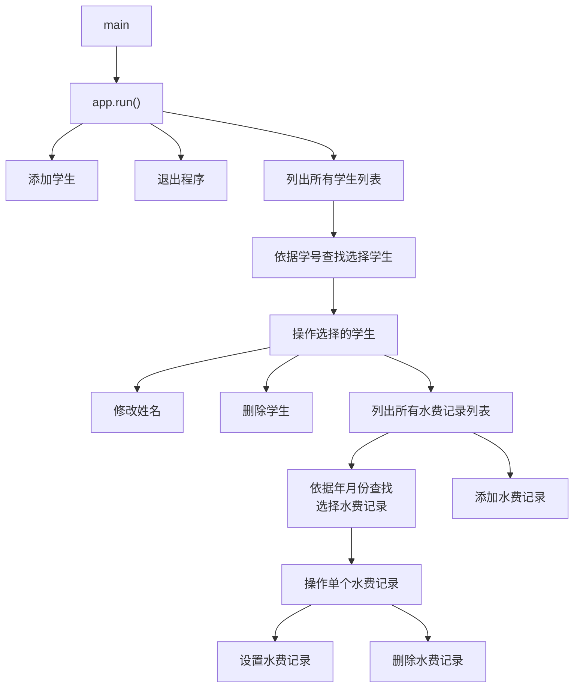

### 设计说明

*  **结构体和类储存学生数据。** `Student` 和 `WaterRecord` 定义数据结构。
   数据结构样式：

    ```cpp
    struct WaterRecord {
        int year;
        int month;
        double usage;
        double cost;
    };

    class Student { // 学生类，包含学号、姓名和水费记录等信息
    public:
        std::string id;
        std::string name;
        std::vector<WaterRecord> records;

        double getTotalUsage() const;
        double getTotalCost() const;
        int getWaterRecordIndex(int year, int month);
    };
    ```

	**此处呈现的代码不一定是最终代码，最终代码请翻阅文件查看。*

*  **使用动态数组供运行时修改。** 使用 `std::vector<Student>` 类型动态储存数据，便于在运行时访问和修改。

*  **json 文件数据格式支持。** 引入外部库 `json.hpp` 用于保存和解析数据文件，数据结构一目了然。

*  **清晰明了的架构设计。** `WaterManager` 类执行数组读取、修改的职责，不关心控制台界面设计；`App` 类实现控制台交互功能，不关心数据如何修改。

*  **灵活的指针与引用操作。** 向其他函数传递对象的指针或引用，数据操作方便高效。

*  **分页查询支持。** `getAllStudents` 和 `getAllRecords` 支持分页显示，每页默认 12 条，页码自动边界检查。

*  **操作结果统一返回。** `WaterManager` 的所有修改操作返回 `result` 结构体，包含 `success`（是否成功）和 `info`（详细信息）两个字段。

*  **输入辅助函数统一处理。** `App` 类提供 `enterId`、`enterName`、`enterYear`、`enterMonth`、`enterUsage` 等函数，统一处理用户输入和合法性校验，支持 `/e` 中途退出。

*  **编码转换处理。** 提供 `gbkToUtf8` 和 `utf8ToGbk` 函数，解决 Windows 控制台（GBK）与 JSON 文件（UTF-8）之间的中文编码转换问题。

*  **数据自动保存。** `WaterManager` 构造时调用 `loadFromFile()` 读取数据，析构时调用 `saveToFile()` 保存数据，每次修改操作后也会自动保存。

*  **文件加载容错。** 加载 `students.json` 时若文件不存在或为空则正常启动；若 JSON 解析失败则自动备份原文件为 `students.json.bak`，并清空数据重新开始。

### 类型

#### App 类

##### 概要

实现控制台终端交互功能。

##### `App.run()` 方法

类型：`void`

说明：展示主菜单列表。输入标识选择操作功能。

流程图：


演示截图：

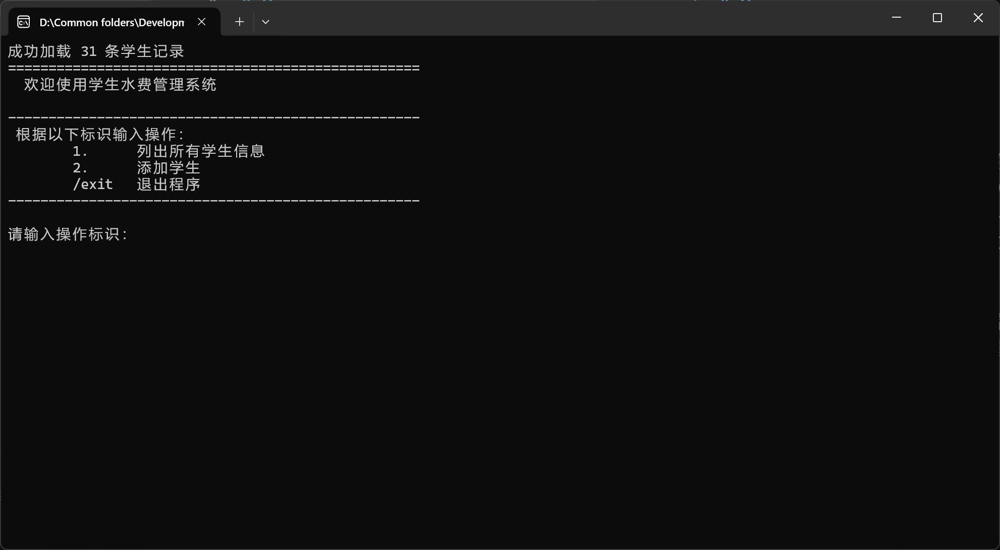

---

##### `App.addStudent()` 方法

类型：`void`

说明：展示添加学生菜单列表。输入学号和姓名添加学生，或输入 `/e` 标识取消添加操作。

流程图：


演示截图：

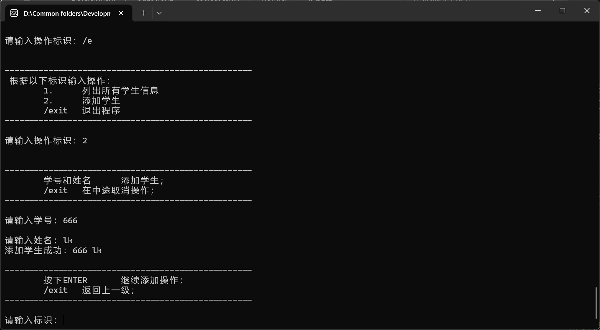

---

##### `App.listAllStudents()` 方法

类型：`void`

说明：展示所有学生列表。输入标识或页码翻阅页面浏览，或输入 `s[学号]` 查找选择学生。

流程图：


演示截图：

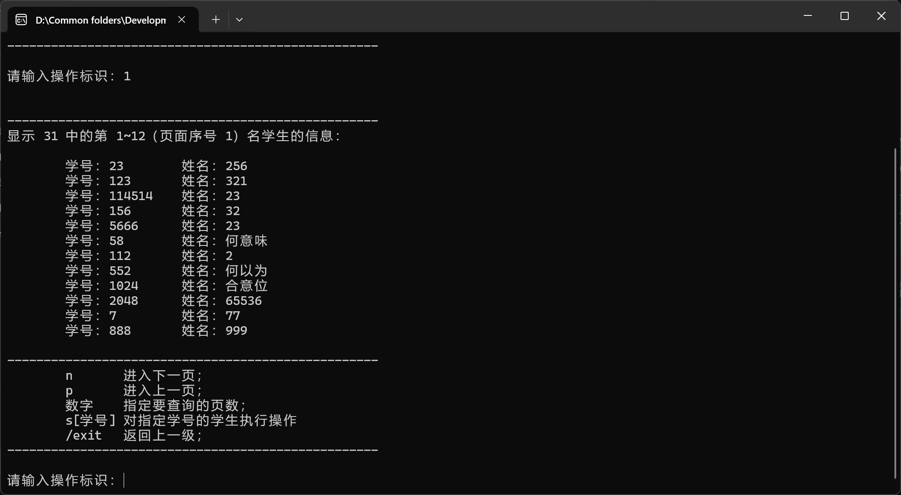

---

##### `App.listAllRecords(const std::string id)` 方法

类型：`void`

说明：展示所有水费记录列表。输入标识或页码翻阅页面浏览，或输入 `s[年-月]` 查找选择记录。

流程图：

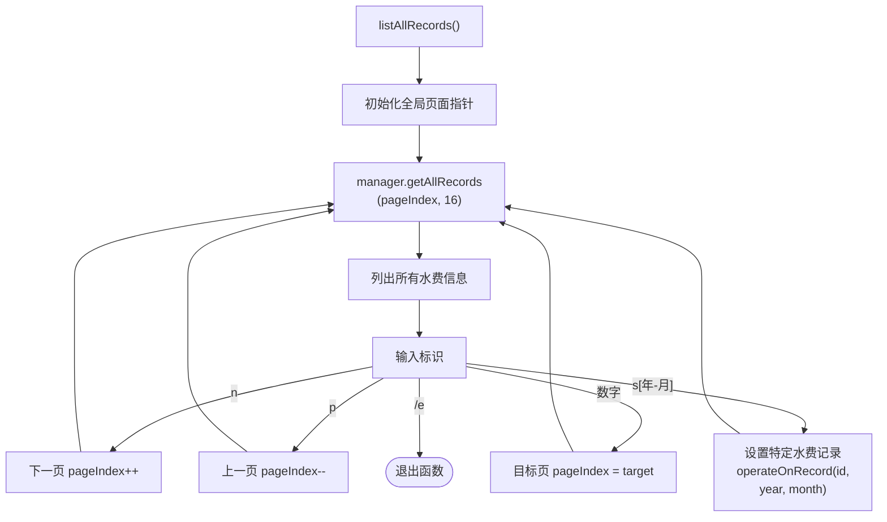

演示截图：

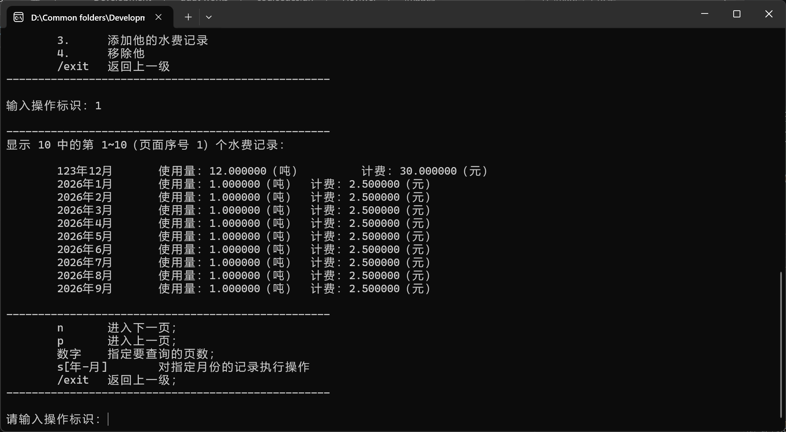

##### `App.operateOnStudent(const std::string id)` 方法

类型：`void`

说明：对单个学生执行操作。输入指定标识查看所有水费记录、设置姓名、添加水费记录、移除学生。

流程图：

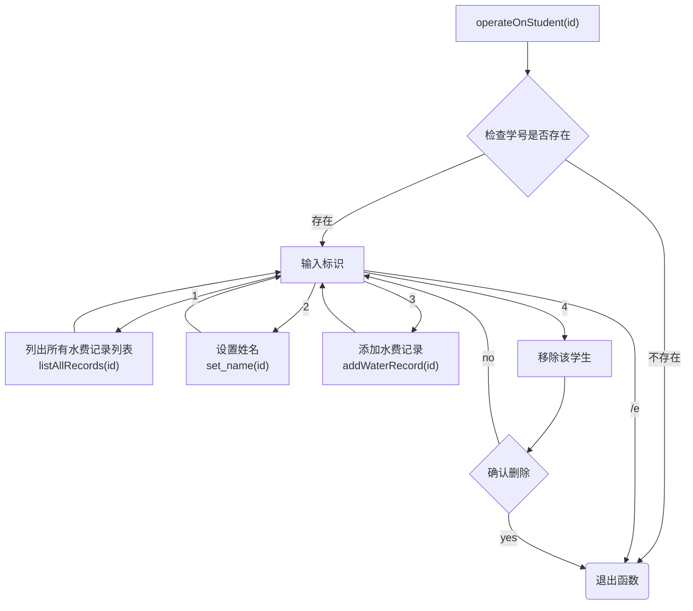

演示截图：

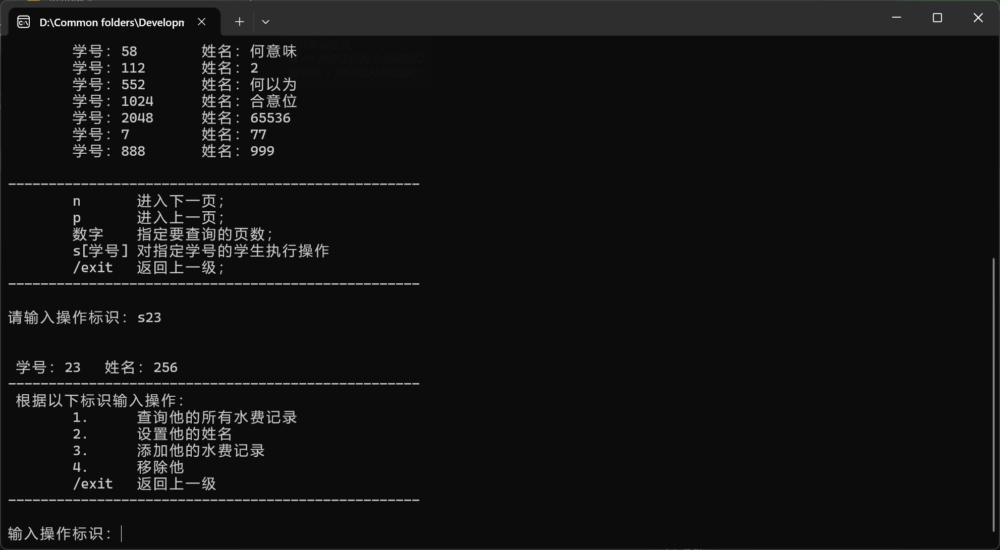

---

##### `App.operateOnRecord(const std::string id, int year, int month)`

类型：`void`

说明：对单个水费记录执行操作。输入指定标识设置这个水费记录、移除这个水费记录。

流程图：

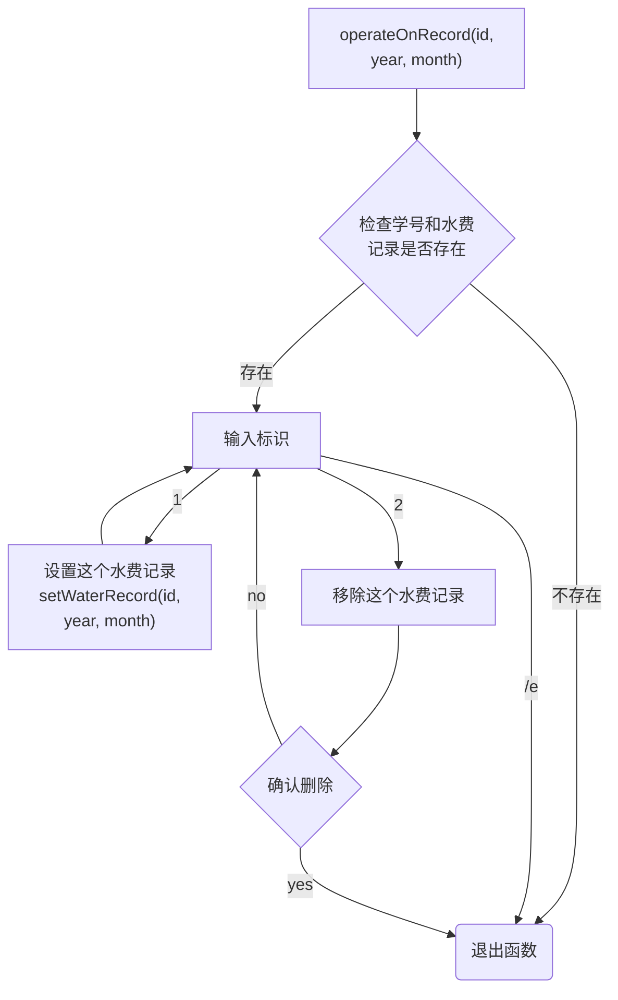

演示截图：

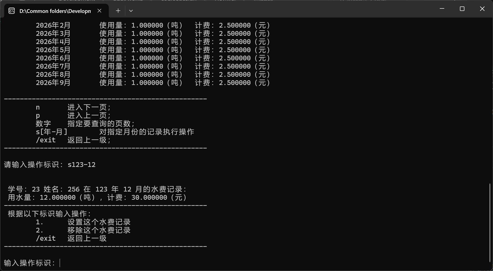

---

##### `App.setName(const std::string id)`

类型：`void`

说明：设置指定学生的名字。

流程图：

未制作

演示截图：

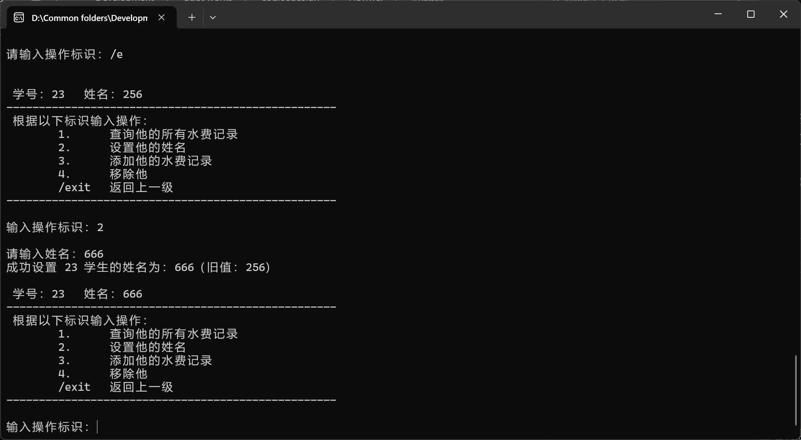

---

##### `App.setWaterRecord(const std::string id, int year, int month)`

类型：`void`

说明：设置指定学生在指定年月的水费记录。

流程图：

未制作

演示截图：

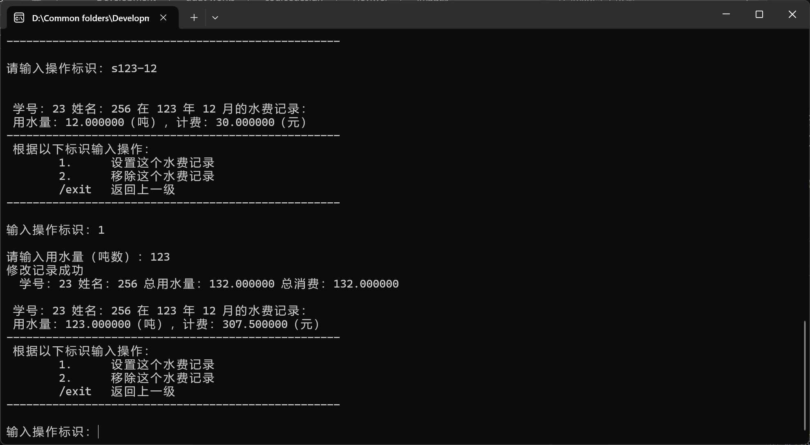

---

##### `App.enterStudent(Student& student)`

类型：`bool`

流程图：

未制作

---

##### `App.enterId(std::string& id)`

类型：`bool`

说明：输入学生学号。

流程图：

未制作

---

##### `App.enterName(std::string& name)`

类型：`bool`

说明：输入学生姓名。

流程图：

未制作

---

##### `App.enterMonth(int& month)`

类型：`bool`

说明：输入月份。

流程图：

未制作

---

##### `App.enterUsage(double& usage)`

类型：`bool`

说明：输入水费记录。

流程图：

未制作

---

##### `App.promptContinue()`

类型：`bool`

说明：提示是否继续。

流程图：

未制作

---

##### `App.addWaterRecord(const std::string id)`

类型：`void`

说明：添加水费记录。

流程图：

未制作

演示截图：

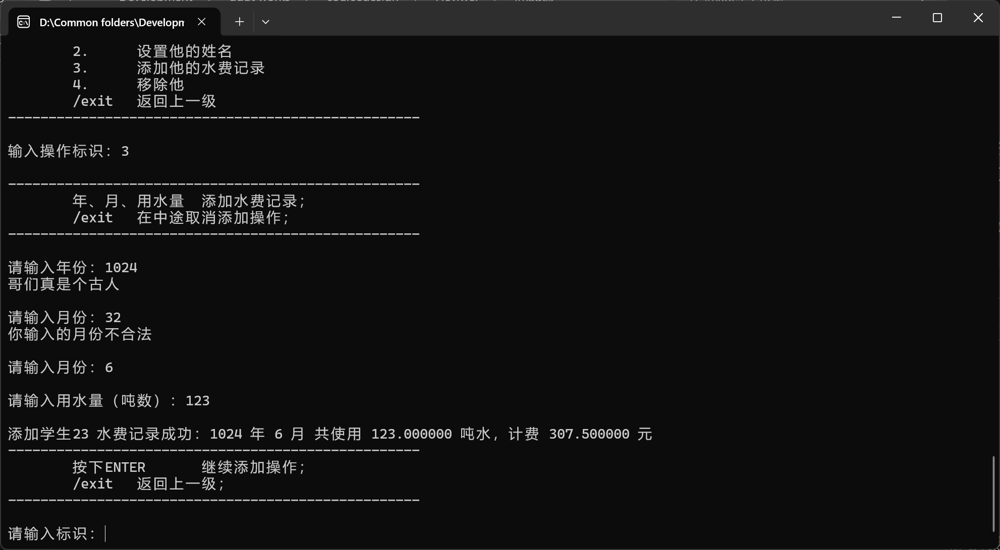

---

#### WaterManager 类

##### 概要

实现数据管理功能。

##### 编码转换辅助函数

由于 Windows 控制台使用 GBK 编码，而 JSON 文件使用 UTF-8 编码，需要两个辅助函数进行转换：

```cpp
std::string gbkToUtf8(const std::string& gbkStr);   // GBK → UTF-8（保存时使用）
std::string utf8ToGbk(const std::string& utf8Str);  // UTF-8 → GBK（加载时使用）
```

---

##### JSON 序列化/反序列化

使用 `nlohmann/json` 库，为 `WaterRecord` 和 `Student` 定义了 `to_json` 和 `from_json` 重载：

---

##### `WaterManager()` 构造函数

类型：无

说明：实例构造时自动调用 `loadFromFile()`，从 `students.json` 加载已有数据。

流程图：

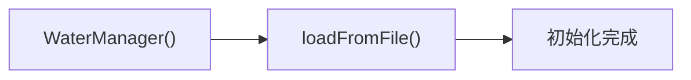

---

##### `~WaterManager()` 析构函数

类型：无

说明：实例销毁时自动调用 `saveToFile()`，将数据保存到 `students.json`。

流程图：

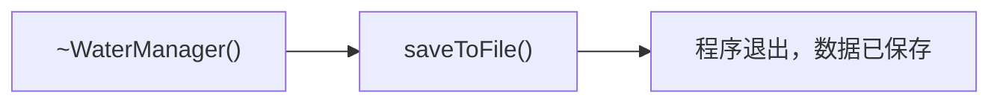

---

##### `WaterManager.loadFromFile()` 方法

类型：`void`

说明：从 `data.json` 文件加载数据。如果文件不存在、为空或格式错误，会进行相应处理（空文件或解析失败时会备份原文件）。

流程图：

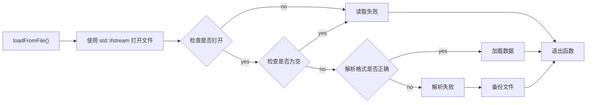

---

##### `WaterManager.saveToFile()` 方法

类型：`void`

说明：将当前数据保存到 `data.json` 文件。在程序退出前或每次数据修改后自动调用。

流程图：

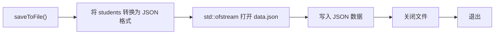

---

##### `WaterManager.findStudentIndex(const std::string& id)` 方法

类型：`int`

说明：根据学号遍历 `students` 数组，若找到匹配的学生返回其索引，否则返回 -1。

流程图：

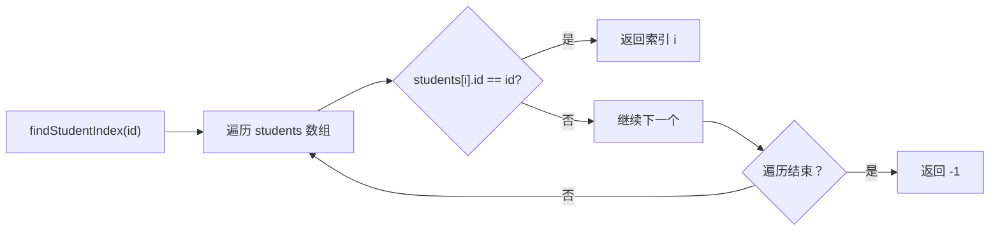

---

##### `WaterManager.addStudent(Student student)` 方法

类型：`Result`

说明：添加新学生。会检查学号是否已存在，以及学号是否包含程序保留标识符。

流程图：

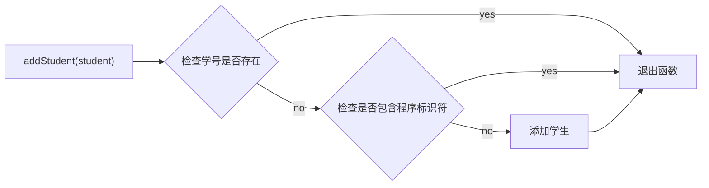

---

##### `WaterManager.setStudent(const std::string& id, const std::string& name)` 方法

类型：`result`

说明：修改指定学生的姓名。

流程图：

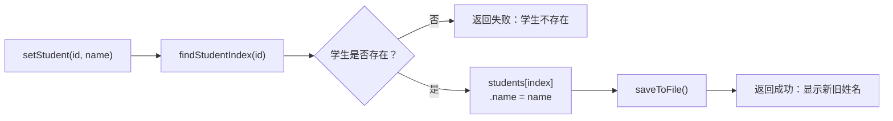

---

##### `WaterManager.removeStudent(const std::string& id)` 方法

类型：`result`

说明：删除指定学生及其所有水费记录。

流程图：

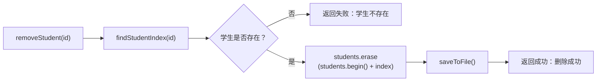

---

##### `WaterManager.addWaterRecord(const std::string& id, const WaterRecord& record)` 方法

类型：`result`

说明：为指定学生添加水费记录。会检查该年月份是否已有记录（不允许重复）。

流程图：

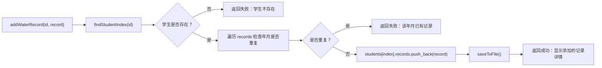

---

##### `WaterManager.setWaterRecord(const std::string& id, int year, int month, double usage)` 方法

类型：`result`

说明：修改指定学生在指定月份的水费记录（用水量）。费用自动按单价重新计算。

流程图：

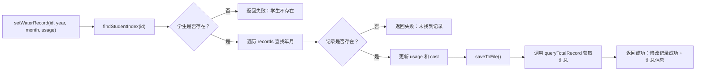

---

##### `WaterManager.removeWaterRecord(const std::string& id, int year, int month)` 方法

类型：`result`

说明：删除指定学生在指定月份的水费记录。

流程图：

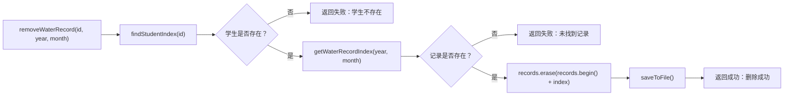

---

##### `WaterManager.getStudent(const std::string& id)` 方法

类型：`Student*`

说明：根据学号获取指向学生的指针。若不存在返回 `nullptr`。

流程图：

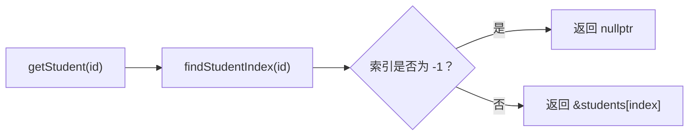

---

## 另请参阅

[C++ 文档 | Microsoft Learn](https://learn.microsoft.com/zh-cn/cpp/cpp/?view=msvc-170 "https://learn.microsoft.com/zh-cn/cpp/cpp/?view=msvc-170")  
[JSON for Modern C++ (nlohmann/json.hpp)](https://json.nlohmann.me/ "https://json.nlohmann.me/")