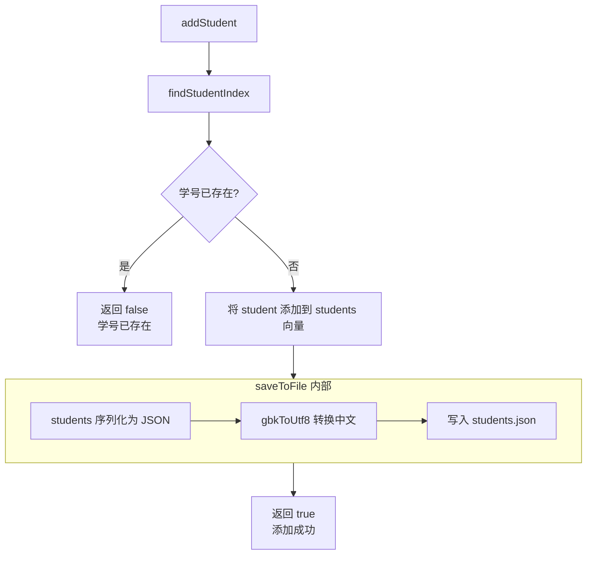

# Heyiwei

何意味

摘要
===

这是一个使用 Visual C++ 编写的学生水费管理系统。使用的开发工具为：Visual studio 2022 （编译环境）、Visual studio code。

这是一个控制台应用，用户在终端界面查看信息、输入指令、输入信息完成基础交互功能。

现有的基础功能包括：

1.  分页查看所有学生信息
2.  添加、删除学生
3.  根据学号查询学生
4.  分页查看单个学生的所有水费记录
5.  添加、删除水费记录
6.  查询特定年月份的水费记录

结构图
---

设计技术
---

1.  结构体储存学生数据。`Student` 

1.  职责单一的类设计。`WaterManager` 类提供自定义公开函数供外部访问，不允许外部访问私有成员

