# Heyiwei

何意味

## 摘要

这是一个使用 C++ 编写的学生水费管理系统。使用的开发工具为：Visual Studio 2022（编译环境 ISO C++14 Standard）、Visual Studio Code（文档编写）。

这是一个控制台应用，用户在终端界面查看信息、输入指令、输入信息完成基础交互功能。

现有的基础功能包括：

1.  分页查看所有学生信息
2.  添加、删除学生
3.  根据学号查询学生
4.  分页查看单个学生的所有水费记录
5.  添加、删除水费记录
6.  查询特定年月份的水费记录
7.  数据的保存与读取

## 参与成员

不在此处呈现。请打开 `members.md` 查看。

## 系统设计

### 总流程图

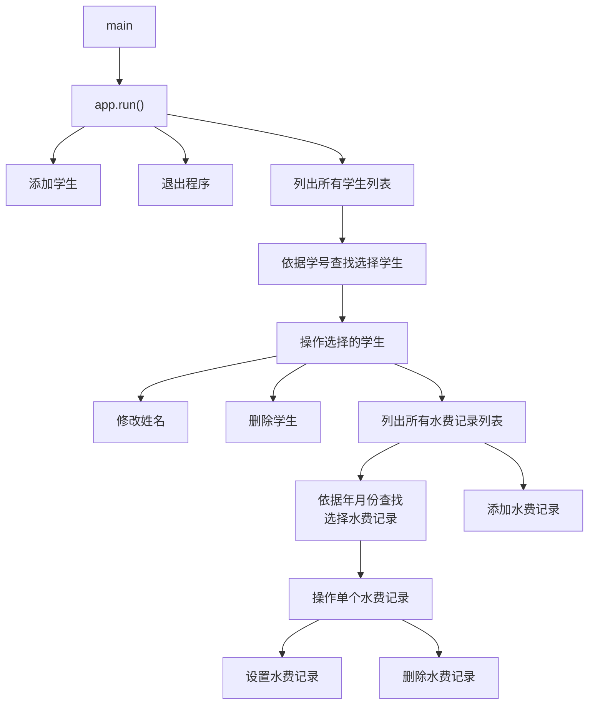

### 设计说明

*  **结构体和类储存学生数据。** `Student` 和 `WaterRecord` 定义数据结构。
   数据结构样式：

    ```cpp
    struct WaterRecord {
        int year;
        int month;
        double usage;
        double cost;
    };

    class Student { // 学生类，包含学号、姓名和水费记录等信息
    public:
        std::string id;
        std::string name;
        std::vector<WaterRecord> records;

        double getTotalUsage() const;
        double getTotalCost() const;
        int getWaterRecordIndex(int year, int month);
    };
    ```

	**此处呈现的代码不一定是最终代码，最终代码请翻阅文件查看。*

*  **使用动态数组供运行时修改。** 使用 `std::vector<Student>` 类型动态储存数据，便于在运行时访问和修改。

*  **json 文件数据格式支持。** 引入外部库 `json.hpp` 用于保存和解析数据文件，数据结构一目了然。

*  **清晰明了的架构设计。** `WaterManager` 类执行数组读取、修改的职责，不关心控制台界面设计；`App` 类实现控制台交互功能，不关心数据如何修改。

*  **灵活的指针与引用操作。** 向其他函数传递对象的指针或引用，数据操作方便高效。

### 类型

#### App 类

##### 作用

实现控制台终端交互功能。

##### 代码

```cpp
class App
{
private:
	WaterManager& manager;
	const double PRICE_PER_TON = 2.5; // 定义常量水费
public:
	App(WaterManager& mgr) : manager(mgr) {}
	void run();
	void listAllStudents();
	void listAllRecords(const std::string id);

	void addStudent();
	void addWaterRecord(const std::string id);

	void operateOnStudent(const std::string id);
	void operateOnRecord(const std::string id, int year, int month);

	void setName(const std::string id);
	void setWaterRecord(const std::string id, int year, int month);

	bool promptContinue();
	bool enterWaterRecord(WaterRecord& record);
	bool enterStudent(Student& student);
	bool enterId(std::string& id);
	bool enterName(std::string& name);
	bool enterYear(int& year);
	bool enterMonth(int& month);
	bool enterUsage(double& usage);
};
```

```cpp
#include <iostream>
#include <string>
#include "WaterManager.h"
#include "App.h"

static bool checkExit(std::string input) {
	if (input == "/exit" || input == "/e") return true;
	return false;
}

/// @brief 展示主菜单列表。输入标识选择操作功能。
void App::run()
{
	//程序开始运行的地方
	std::cout << "===================================================\n";
	std::cout << "  欢迎使用学生水费管理系统\n";

	while (1) {
		std::cout << "---------------------------------------------------\n";
		std::cout << " 根据以下标识输入操作：\n";
		std::cout << "\t1.\t列出所有学生信息\n";
		std::cout << "\t2.\t添加学生\n";
		std::cout << "\t/exit\t退出程序\n";
		std::cout << "---------------------------------------------------\n\n";
		std::cout << "请输入操作标识：";
 
		// 读取用户输入
		std::string input;
		std::getline(std::cin, input);
  
		// 判断是否输入了退出指令
		if (checkExit(input)) {
			std::cout << "程序即将退出\n";
			return;
		}

		// 判断是否在扣问号
		if (input == "?" || input == "？" || input == "." || input == "。") {
			std::cout << input + "\n";
			continue;
		}

		int operation = 0;
		try {
			// 尝试将用户输入转换为数字。转换失败将进入 catch 内部
			operation = std::stoi(input);
		}
		catch (...) {
			std::cout << "你输的啥？\n";
			continue; // 进入下一个循环，重新输入内容
		}

		// 判断输入的序号是否在操作选项列表内
		if (operation < 1 || operation > 2) {
			std::cout << "输入的序号不在操作选项列表中\n";
			continue;
		}

		std::cout << "\n";

		switch (operation) {
		case 1:
			listAllStudents();
			break;
		case 2:
			addStudent();
			break;
		}
	}
}

int allStudentsPageIndex = 1; // 全局变量，可用于保存上次查阅时的页面序号

/// @brief 展示所有学生列表。输入标识或页码翻阅页面浏览，或输入 s[序号] 查找选择学生。
void App::listAllStudents()
{
	int* pageIndex = &allStudentsPageIndex; // 使用指针
	result res;
	while (1) {
		res = manager.getAllStudents(pageIndex, 16); // 传入页面索引的指针，调用的函数内部对索引的修改会反映在此。
		std::cout << "---------------------------------------------------\n";
		std::cout << res.info;
		std::string input;

		while (1) {
			std::cout << "\n---------------------------------------------------\n";
			std::cout << "\tn\t进入下一页；\n";
			std::cout << "\tp\t进入上一页；\n";
			std::cout << "\t数字\t指定要查询的页数；\n";
			std::cout << "\ts[学号]\t对指定学号的学生执行操作\n";
			std::cout << "\t/exit\t返回上一级；\n";
			std::cout << "---------------------------------------------------\n\n";
			std::cout << "请输入操作标识：";
			std::getline(std::cin, input);

			// 判断是否输入了空内容
			if (input.empty()) {
				std::cout << "你需要输入一些内容，或输入 exit 返回上一级";
				continue;
			}

			// 判断是否输入了退出指令
			if (checkExit(input)) return;

			// 判断输入的 s[学号] 格式
			if (input.length() >= 2 && (input[0] == 's' || input[0] == 'S')) {
				std::string numStr = input.substr(1);
				if (manager.getStudent(numStr) == nullptr) {
					std::cout << "\n没有找到指定学号的学生\n";
					break;
				}
				operateOnStudent(numStr);
				break;
			}

			try {
				// 将输入的字符串转换为数字
				*pageIndex = std::stoi(input);
				break;
			}
			catch (...) {
			}

			if (input == "n" || input == "next" ) {
				(*pageIndex)++; // 下一页
				break;
			}

			if (input == "p" || input == "previous") {
				(*pageIndex)--; // 上一页
				break;
			}

			std::cout << "你输入的标识不合法";
		}
	}
}

int allRecordsPageIndex = 1;

/// @brief 展示所有水费记录列表。输入标识或页码翻阅页面浏览，或输入 s[年-月] 查找选择记录。
/// @param id 学生学号
void App::listAllRecords(const std::string id)
{
	int* pageIndex = &allRecordsPageIndex;
	result res;

	while (1) {
		res = manager.getAllRecords(id, pageIndex, 16);
		std::cout << "\n---------------------------------------------------\n";
		std::cout << res.info;
		std::string input;

		while (1) {
			std::cout << "\n---------------------------------------------------\n";
			std::cout << "\tn\t进入下一页；\n";
			std::cout << "\tp\t进入上一页；\n";
			std::cout << "\t数字\t指定要查询的页数；\n";
			std::cout << "\ts[年-月]\t对指定月份的记录执行操作\n";
			std::cout << "\t/exit\t返回上一级；\n";
			std::cout << "---------------------------------------------------\n\n";
			std::cout << "请输入操作标识：";
			std::getline(std::cin, input);

			if (input.empty()) {
				std::cout << "你需要输入一些内容，或输入 exit 返回上一级";
				continue;
			}
   
			// 判断是否输入了退出指令
			if (checkExit(input)) return;
  
			// 判断输入的 s[年-月] 格式
			if (input.length() >= 2 && (input[0] == 's' || input[0] == 'S')) {
				std::string dateStr = input.substr(1);

				// 解析年-月格式
				size_t dashPos = dateStr.find('-');
				if (dashPos == std::string::npos) {
					std::cout << "格式错误，请使用 年-月 格式，例如：s2026-04";
					continue;
				}

				try {
					//尝试将输入的字符串转换为数字
					int year = std::stoi(dateStr.substr(0, dashPos));
					int month = std::stoi(dateStr.substr(dashPos + 1));

					// 验证年月有效性
					if (year < 1 || month < 1 || month > 12) {
						std::cout << "年份或月份无效";
						continue;
					}

					// 调用操作指定月份记录的函数
					operateOnRecord(id, year, month);

					// 操作完成后刷新当前页面
					break;
				}
				catch (...) {
					std::cout << "年月格式不正确，请使用数字";
					continue;
				}
			}

			try {
				*pageIndex = std::stoi(input);
				break;
			}
			catch (...) {
			}

			if (input == "n" || input == "next") {
				(*pageIndex)++;
				break;
			}

			if (input == "p" || input == "previous") {
				(*pageIndex)--;
				break;
			}

			std::cout << "你输入的标识不合法";
		}
	}
}

/// @brief 对指定月份的水费记录执行操作
/// @param id 学生学号
/// @param year 年份
/// @param month 月份
void App::operateOnRecord(const std::string id, int year, int month)
{
	std::string input;
	auto* student = manager.getStudent(id);
	if (student == nullptr) {
		std::cout << "没有找到目标学号的学生";
		return;
	}
	int index = student->getWaterRecordIndex(year, month);
	if (index == -1) {
		std::cout << "未找到目标年月份的水费记录";
		return;
	}
	while (1) {
		std::cout <<
			"\n 学号：" + id +
			std::to_string(year) + " 年 " +
			std::to_string(month) + " 月的水费记录  " +
			std::to_string(student->records[index].usage) + " （吨） " +
			std::to_string(student->records[index].cost) + " （元）\n";
		std::cout << "---------------------------------------------------\n";
		std::cout << " 根据以下标识输入操作：\n";
		std::cout << "\t1.\t设置这个水费记录\n";
		std::cout << "\t2.\t移除这个水费记录\n";
		std::cout << "\t/exit\t返回上一级\n";
		std::cout << "---------------------------------------------------\n\n";
		std::cout << "输入操作标识：";

		std::getline(std::cin, input);

		if (checkExit(input)) return;

		if (input.empty()) {
			std::cout << "你需要输入一些内容，或输入 exit 返回上一级\n";
			continue;
		}

		int operation = 0;
		try {
			operation = std::stoi(input);
		}
		catch (...) {
			std::cout << "你输的啥？ 按下ENTER键重新输入\n";
			std::getline(std::cin, input);
			continue;
		}

		if (operation < 1 || operation > 2) {
			std::cout << "输入的序号不在操作选项列表中 按下ENTER键重新输入\n";
			std::getline(std::cin, input);
			continue;
		}

		result res;

		switch (operation) {
		case 1:
			setWaterRecord(id, year, month);
			break;
		case 2:
			std::cout << "确定要移除这个吗？(yes/no)";
			std::getline(std::cin, input);
			if (input == "yes") {
				res = manager.removeWaterRecord(id, year, month);
				std::cout << res.info + "\n";
				return;
			}
			break;
		}
	}
}

/// @brief 对单个学生执行操作。输入指定标识查看所有水费记录、设置姓名、添加水费记录、移除学生。
/// @param id 学生学号
void App::operateOnStudent(const std::string id) {
	std::string input;
	auto* student = manager.getStudent(id);
	if (student == nullptr) {
		std::cout << "没有找到目标学号的学生";
		return;
	}
	while (1) {
		std::cout << "\n 学号：" + id + " 姓名：" + student->name + "\n";
		std::cout << "---------------------------------------------------\n";
		std::cout << " 根据以下标识输入操作：\n";
		std::cout << "\t1.\t查询他的所有水费记录\n";
		std::cout << "\t2.\t设置他的姓名\n";
		std::cout << "\t3.\t添加他的水费记录\n";
		std::cout << "\t4.\t移除他\n";
		std::cout << "\t/exit\t返回上一级\n";
		std::cout << "---------------------------------------------------\n\n";
		std::cout << "输入操作标识：";

		std::getline(std::cin, input);

		if (checkExit(input)) return;

		if (input.empty()) {
			std::cout << "你需要输入一些内容，或输入 exit 返回上一级\n";
			continue;
		}

		int operation = 0;
		try {
			operation = std::stoi(input);
		}
		catch (...) {
			std::cout << "你输的啥？ 按下ENTER键重新输入\n";
			std::getline(std::cin, input);
			continue;
		}

		if (operation < 1 || operation > 4) {
			std::cout << "输入的序号不在操作选项列表中 按下ENTER键重新输入\n";
			std::getline(std::cin, input);
			continue;
		}

		result res;

		switch (operation) {
		case 1:
			listAllRecords(id);
			break;
		case 2:
			setName(id);
			break;
		case 3:
			addWaterRecord(id);
			break;
		case 4:
			std::cout << "确定要移除他吗？(yes/no)";
			std::getline(std::cin, input);
			if (input == "yes") {
				res = manager.removeStudent(id);
				std::cout << res.info + "\n";
				return;
			}
			else {
				std::cout << "已取消移除操作";
			}
		}
	}
}

/// @brief 设置指定学生的名字
/// @param id 学生学号
void App::setName(const std::string id) {
	std::string name;
	if (!enterName(name)) return;
	result res = manager.setStudent(id, name);
	std::cout << res.info;
}

/// @brief 设置指定学生在指定年月的水费记录
/// @param id 学生学号
/// @param year 年份
/// @param month 月份
void App::setWaterRecord(const std::string id, int year, int month)
{
	double usage;
	if (!enterUsage(usage)) return;
	result res = manager.setWaterRecord(id, year, month, usage);
	std::cout << res.info;
}

/// @brief 展示添加学生菜单列表。输入学号和姓名添加学生，或输入 `/exit` 标识取消添加操作。
void App::addStudent() {
	Student student;
	while (1) {
		if (!enterStudent(student)) return;

		result res = manager.addStudent(student);
		if (!res.success) {
			std::cout << "添加失败！原因：" << res.info;
		}
		else {
			std::cout << "添加成功：" << res.info;
		}

		if (!promptContinue()) return;
	}
}

/// @brief 输入学生信息
/// @param student 学生对象
/// @return 是否输入成功
bool App::enterStudent(Student& student) {

	std::cout << "---------------------------------------------------\n";
	std::cout << "\t学号和姓名\t添加学生；\n";
	std::cout << "\t/exit\t在中途取消操作；\n";
	std::cout << "---------------------------------------------------\n\n";

	std::string id;
	if (!enterId(id)) return false;

	std::string name;
	if (!enterName(name)) return false;

	student.id = id;
	student.name = name;

	return true;
}

/// @brief 输入学生学号
/// @param id 学号
/// @return 是否输入成功
bool App::enterId(std::string& id)
{
	std::string input;

	while (1) {
		std::cout << "请输入学号：";
		std::getline(std::cin, input);

		if (checkExit(input)) return false;

		if (input.empty()) {
			std::cout << "你需要输入一些内容，或输入 exit 取消添加操作\n";
			continue;
		}

		Student* student = manager.getStudent(input);
		if (student == nullptr) break;
		std::cout << "不可添加具有相同学号的学生\n";
		continue;
	}

	id = input;
	return true;
}

/// @brief 输入学生姓名
/// @param name 姓名
/// @return 是否输入成功
bool App::enterName(std::string& name)
{
	std::string input;

	while (1) {
		std::cout << "请输入姓名：";
		std::getline(std::cin, input);

		if (checkExit(input)) return false;

		if (input.empty()) {
			std::cout << "你需要输入一些内容，或输入 exit 取消添加操作\n";
			continue;
		}
		break;
	}

	name = input;
	return true;
}

/// @brief 输入年份
/// @param year 年份
/// @return 是否输入成功
bool App::enterYear(int& year) {
	std::string input;
	while (1) {
		std::cout << "\n请输入年份：";
		std::getline(std::cin, input);

		if (checkExit(input)) return false;

		if (input.empty()) {
			std::cout << "你需要输入一些内容，或输入 exit 取消添加操作\n";
			continue;
		}

		try {
			year = std::stoi(input);

			if (year <= 0) return false;

			if (year <= 1900)
				std::cout << "哥们真是个古人\n";
			else if (year <= 2000)
				std::cout << "哥们真是活在上个世纪的人\n";

			auto now = std::time(nullptr);
			std::tm localTimeStruct;
			auto* localTime = &localTimeStruct;
#if defined(_MSC_VER)
			localtime_s(localTime, &now);
#else
			localtime_r(&now, localTime);
#endif
			int currentYear = localTime->tm_year + 1900;

			if (year > currentYear)
				std::cout << "哥们真是从未来穿越回来的人\n";

			break;
		}
		catch (const std::exception&) {
			std::cout << "你输入的年份不合法\n";
			continue;
		}
	}
	return true;
}

/// @brief 输入月份
/// @param month 月份
/// @return 是否输入成功
bool App::enterMonth(int& month) {
	std::string input;
	while (1) {
		std::cout << "\n请输入月份：";
		std::getline(std::cin, input);

		if (checkExit(input)) return false;

		if (input.empty()) {
			std::cout << "你需要输入一些内容，或输入 exit 取消添加操作\n";
			continue;
		}

		try {
			month = std::stoi(input);
			if (month >= 1 && month <= 12) break;
		}
		catch (...) {
			std::cout << "请输入一个有效数字\n";
			continue;
		}

		std::cout << "你输入的月份不合法\n";
	}
	return true;
}

/// @brief 输入用水量
/// @param usage 用水量
/// @return 是否输入成功
bool App::enterUsage(double& usage) {
	std::string input;
	while (1) {
		std::cout << "\n请输入用水量（吨数）：";
		std::getline(std::cin, input);

		if (checkExit(input)) return false;

		if (input.empty()) {
			std::cout << "你需要输入一些内容，或输入 exit 取消添加操作\n";
			continue;
		}

		try {
			usage = std::stod(input);
			if (usage < 0) throw;
			break;
		}
		catch (...) {
			std::cout << "你输入的数据不合法\n";
			continue;
		}
	}
	return true;
}

/// @brief 输入水费记录
/// @param record 水费记录对象
/// @return 是否输入成功
bool App::enterWaterRecord(WaterRecord& record)
{
	std::string input;

	std::cout << "---------------------------------------------------\n";
	std::cout << "\t年、月、用水量\t添加水费记录；\n";
	std::cout << "\t/exit\t返回上一级；\n";
	std::cout << "---------------------------------------------------\n";

	int year, month;
	double usage;

	if (!enterYear(year)) return false;
	if (!enterMonth(month)) return false;
	if (!enterUsage(usage)) return false;

	record.year = year;
	record.month = month;
	record.usage = usage;
	record.cost = usage * PRICE_PER_TON;

	return true;
}

/// @brief 提示是否继续
/// @return 是否继续
bool App::promptContinue() {
	std::string input;

	std::cout << "\n---------------------------------------------------\n";
	std::cout << "\t按下ENTER\t继续添加操作；\n";
	std::cout << "\t/exit\t返回上一级；\n";
	std::cout << "---------------------------------------------------\n";
	std::cout << "请输入标识：";
	std::getline(std::cin, input);

	return !checkExit(input);
}

/// @brief 添加水费记录
/// @param id 学号
void App::addWaterRecord(const std::string id)
{
	while (1) {
		WaterRecord record;
		if (!enterWaterRecord(record)) return;

		result res = manager.addWaterRecord(id, record);
		std::cout << (res.success ? "成功：" : "失败：") << res.info << "\n";

		if (!promptContinue()) return;
	}
}
```

##### `App.run()` 方法

类型：`void`

说明：展示主菜单列表。输入标识选择操作功能。

流程图：

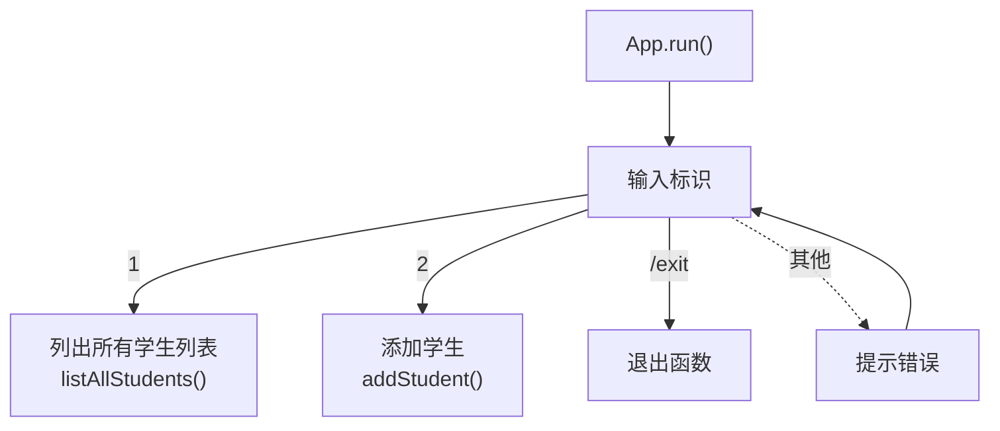

---

##### `App.addStudent()` 方法

类型：`void`

说明：展示添加学生菜单列表。输入学号和姓名添加学生，或输入 `/exit` 标识取消添加操作。

流程图：

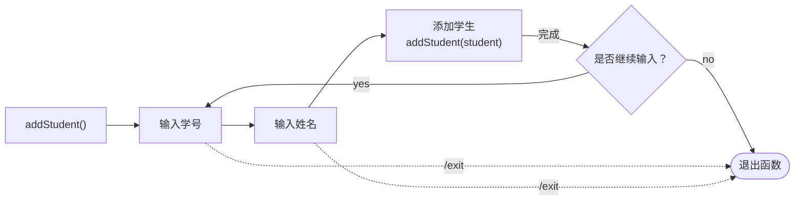

---

##### `App.listAllStudents()` 方法

类型：`void`

说明：展示所有学生列表。输入标识或页码翻阅页面浏览，或输入 `s[学号]` 查找选择学生。

流程图：

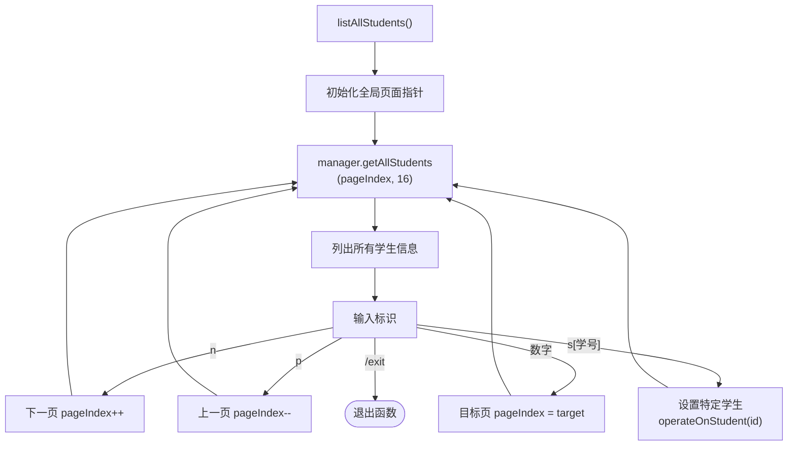

---

##### `App.listAllRecords(const std::string id)` 方法

类型：`void`

说明：展示所有水费记录列表。输入标识或页码翻阅页面浏览，或输入 `s[年-月]` 查找选择记录。

流程图：


##### `App.operateOnStudent(const std::string id)` 方法

类型：`void`

说明：对单个学生执行操作。输入指定标识查看所有水费记录、设置姓名、添加水费记录、移除学生。

流程图：


---

##### `App.operateOnRecord(const std::string id, int year, int month)`

类型：`void`

说明：对单个水费记录执行操作。输入指定标识设置这个水费记录、移除这个水费记录。

流程图：


---

##### `App.setName(const std::string id)`

类型：`void`

说明：设置指定学生的名字。

流程图：

未制作

---

##### `App.setWaterRecord(const std::string id, int year, int month)`

类型：`void`

说明：设置指定学生在指定年月的水费记录。

流程图：

未制作

---

##### `App.enterStudent(Student& student)`

类型：`bool`

流程图：

未制作

---

##### `App.enterId(std::string& id)`

类型：`bool`

说明：输入学生学号。

流程图：

未制作

---

##### `App.enterName(std::string& name)`

类型：`bool`

说明：输入学生姓名。

流程图：

未制作

---

##### `App.enterMonth(int& month)`

类型：`bool`

说明：输入月份。

流程图：

未制作

---

##### `App.enterUsage(double& usage)`

类型：`bool`

说明：输入水费记录。

流程图：

未制作

---

##### `App.promptContinue()`

类型：`bool`

说明：提示是否继续。

流程图：

未制作

---

##### `App.addWaterRecord(const std::string id)`

类型：`void`

说明：添加水费记录。

流程图：

未制作

---

#### WaterManager 类

##### 作用

实现数据管理功能。

##### 代码

```cpp
struct result {
	bool success; // 利用布尔值判断成功与否
	std::string info; // 利用一个字符串字段来对成功与否的说明
};

// 水费管理类的声明
class WaterManager
{
private: // 外部函数无法调用部分
	std::vector<Student> students; // 定义一个用于储存每个学生数据的动态数组
	const double PRICE_PER_TON = 2.5; // 定义常量水费

	int findStudentIndex(const std::string& id); // 传递id这个数据用传递地址的方法
	void saveToFile();
	void loadFromFile();

public: // 外部函数可以调用部分
	WaterManager();
	~WaterManager();

	result getAllStudents(int* pageIndex, int count);
	result getAllRecords(const std::string& id, int* paggeIndex, int count);
	Student* getStudent(const std::string& id);

	result queryTotalRecord(const std::string& id);

	result addStudent(Student student);
	result setStudent(const std::string& id, const std::string& name);
	result removeStudent(const std::string& id);

	result addWaterRecord(const std::string& id, const WaterRecord& record);
	result setWaterRecord(const std::string& id, int year, int month, double usage);
	result removeWaterRecord(const std::string& id, int year, int month);
};
```

```cpp

```

**此处呈现的代码不一定是最终代码，最终代码请翻阅文件查看。*

##### 编码转换辅助函数

由于 Windows 控制台使用 GBK 编码，而 JSON 文件使用 UTF-8 编码，需要两个辅助函数进行转换：

```cpp
std::string gbkToUtf8(const std::string& gbkStr);   // GBK → UTF-8（保存时使用）
std::string utf8ToGbk(const std::string& utf8Str);  // UTF-8 → GBK（加载时使用）
```

---

##### JSON 序列化/反序列化

使用 `nlohmann/json` 库，为 `WaterRecord` 和 `Student` 定义了 `to_json` 和 `from_json` 重载：

---

##### `WaterManager()` 构造函数

类型：无

说明：实例构造时自动调用 `loadFromFile()`，从 `students.json` 加载已有数据。

流程图：

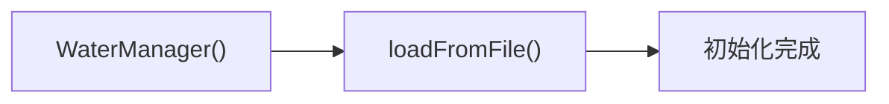

---

##### `~WaterManager()` 析构函数

类型：无

说明：实例销毁时自动调用 `saveToFile()`，将数据保存到 `students.json`。

流程图：

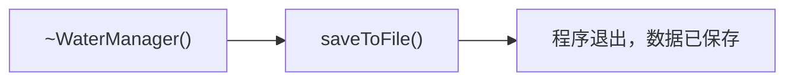

---

##### `WaterManager.loadFromFile()` 方法

类型：`void`

说明：从 `data.json` 文件加载数据。如果文件不存在、为空或格式错误，会进行相应处理（空文件或解析失败时会备份原文件）。

流程图：

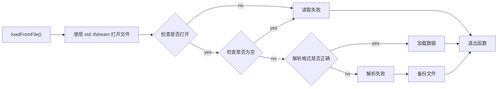

---

##### `WaterManager.saveToFile()` 方法

类型：`void`

说明：将当前数据保存到 `data.json` 文件。在程序退出前或每次数据修改后自动调用。

流程图：

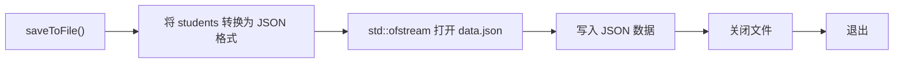

---

##### `WaterManager.findStudentIndex(const std::string& id)` 方法

类型：`int`

说明：根据学号遍历 `students` 数组，若找到匹配的学生返回其索引，否则返回 -1。

流程图：

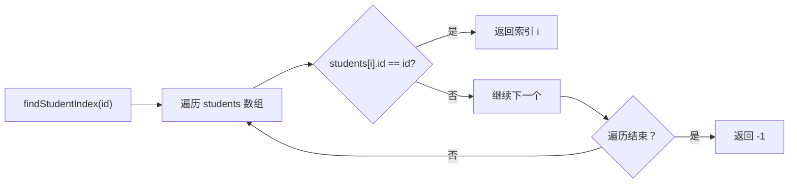

---

##### `WaterManager.addStudent(Student student)` 方法

类型：`Result`

说明：添加新学生。会检查学号是否已存在，以及学号是否包含程序保留标识符。

流程图：

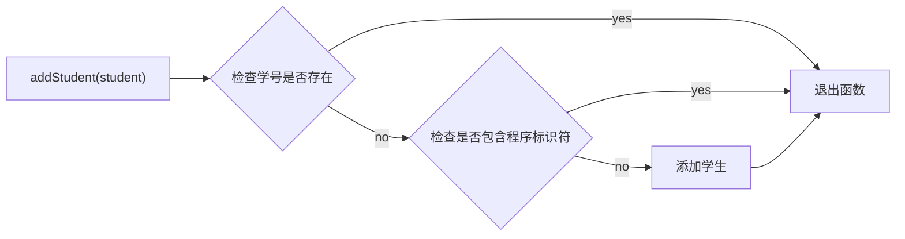

---

##### `WaterManager.setStudent(const std::string& id, const std::string& name)` 方法

类型：`result`

说明：修改指定学生的姓名。

流程图：

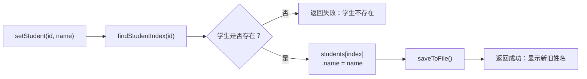

---

##### `WaterManager.removeStudent(const std::string& id)` 方法

类型：`result`

说明：删除指定学生及其所有水费记录。

流程图：

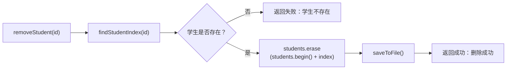

---

##### `WaterManager.addWaterRecord(const std::string& id, const WaterRecord& record)` 方法

类型：`result`

说明：为指定学生添加水费记录。会检查该年月份是否已有记录（不允许重复）。

流程图：

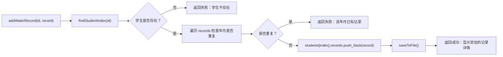

---

##### `WaterManager.setWaterRecord(const std::string& id, int year, int month, double usage)` 方法

类型：`result`

说明：修改指定学生在指定月份的水费记录（用水量）。费用自动按单价重新计算。

流程图：

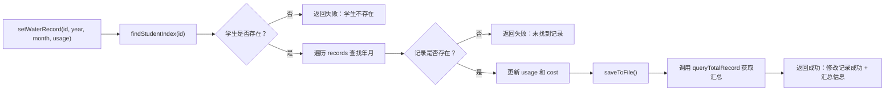

---

##### `WaterManager.removeWaterRecord(const std::string& id, int year, int month)` 方法

类型：`result`

说明：删除指定学生在指定月份的水费记录。

流程图：

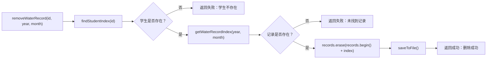

---

##### `WaterManager.getStudent(const std::string& id)` 方法

类型：`Student*`

说明：根据学号获取指向学生的指针。若不存在返回 `nullptr`。

流程图：

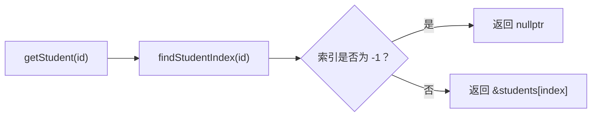

---