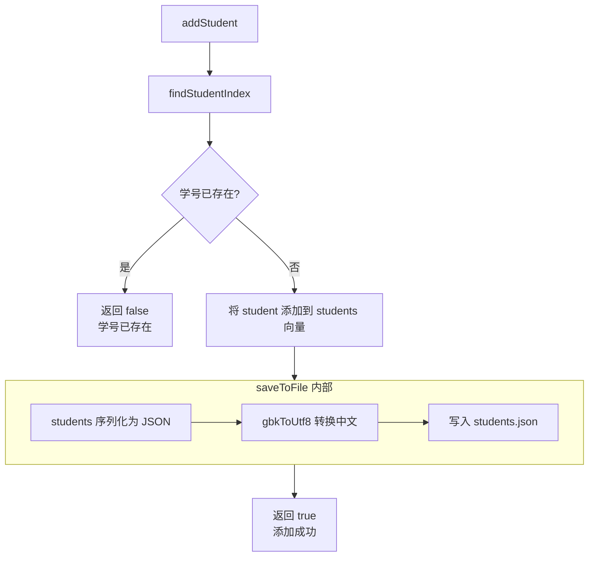

# Heyiwei

何意味

摘要
===

这是一个使用 Visual C++ 编写的学生水费管理系统。使用的开发工具为：Visual studio 2022 （编译环境）、Visual studio code。

这是一个控制台应用，用户在终端界面查看信息、输入指令、输入信息完成基础交互功能。

现有的基础功能包括：

1.  分页查看所有学生信息
2.  添加、删除学生
3.  根据学号查询学生
4.  分页查看单个学生的所有水费记录
5.  添加、删除水费记录
6.  查询特定年月份的水费记录

结构图
---

设计技术
---

1.  结构体储存学生数据。`Student` 和 `WaterRecord` 定义数据结构。

2.  使用动态数组供运行时修改。使用 `std::vector<Students>` 类型动态储存数据，便于在运行是访问和修改。

3.  json 文件数据格式支持。引入外部库 `json.hpp` 用于保存和解析数据文件，数据结构一目了然。

4.  清晰明了的架构设计。`WaterManager` 类执行数组读取、修改的职责，不关心控制台界面设计；`App` 类实现控制台交互功能，不关心数据如何修改。

5.  灵活的指针与引用操作。向其他函数传递对象的指针或引用，数据操作更加方便高效。

