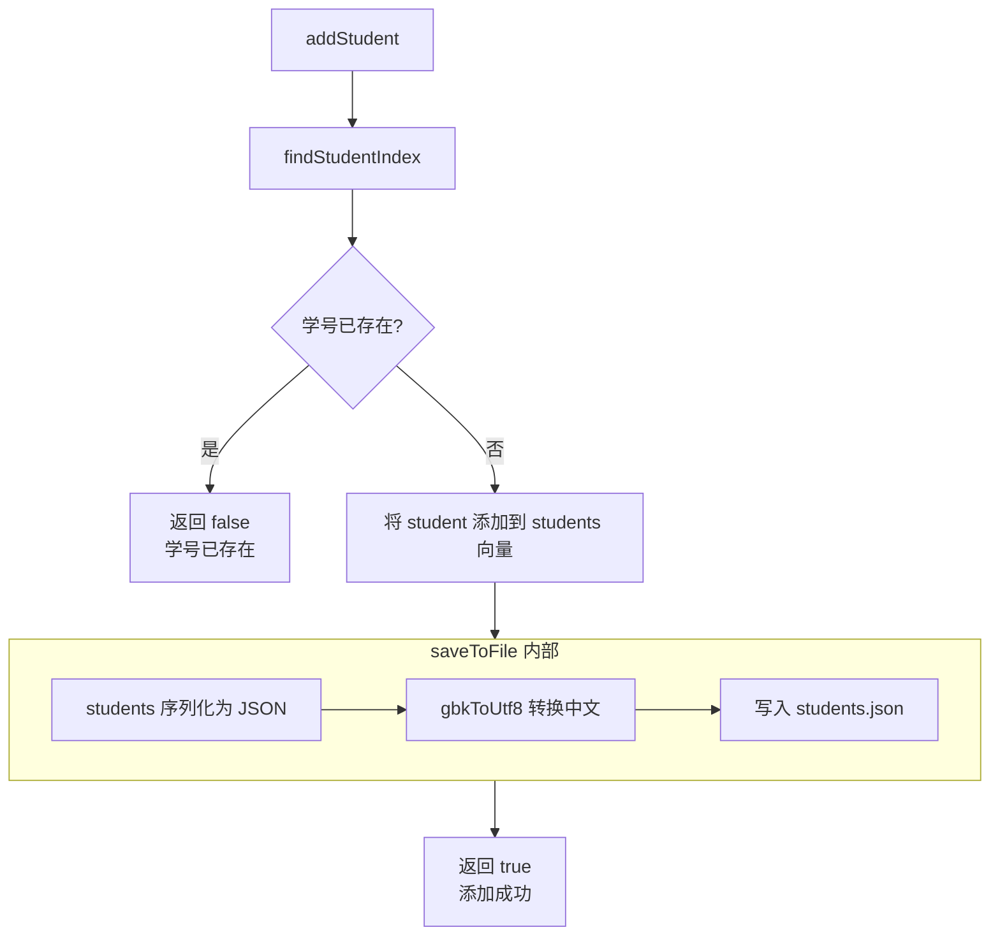

# Heyiwei

何意味

```mermaid
flowchart TD
    A[addStudent] --> B[findStudentIndex]
    B --> C{学号已存在?}
    C -->|是| D[返回 false<br>学号已存在]
    
    C -->|否| E[将 student 添加到 students 向量]
    E --> F[saveToFile]
    
    subgraph F [saveToFile 内部]
        F1[students 序列化为 JSON] --> F2[gbkToUtf8 转换中文]
        F2 --> F3[写入 students.json]
    end
    
    F --> G[返回 true<br>添加成功]
```