# Heyiwei

何意味

使用 markdown 编写文档，帮助你高效完成结构清晰、格式统一的文档设计！

- [Heyiwei](#heyiwei)
  - [摘要](#摘要)
  - [参与成员](#参与成员)
  - [需求分析](#需求分析)
  - [使用说明](#使用说明)
    - [开发环境](#开发环境)
    - [编译运行步骤](#编译运行步骤)
    - [菜单操作](#菜单操作)
  - [系统设计](#系统设计)
    - [学生信息管理](#学生信息管理)
    - [水费记录管理](#水费记录管理)
    - [数据持久化](#数据持久化)
    - [交互设计](#交互设计)
    - [遇到的困难\&解决方案](#遇到的困难解决方案)
      - [锟斤拷（编码错误问题）](#锟斤拷编码错误问题)
      - [窗口直接关闭导致数据丢失](#窗口直接关闭导致数据丢失)
      - [JSON 文件损坏导致程序崩溃](#json-文件损坏导致程序崩溃)
    - [总流程图](#总流程图)
    - [设计说明](#设计说明)
    - [类型](#类型)
      - [App 类](#app-类)
        - [概要](#概要)
        - [`App.run()` 方法](#apprun-方法)
        - [`App.addStudent()` 方法](#appaddstudent-方法)
        - [`App.listAllStudents()` 方法](#applistallstudents-方法)
        - [`App.listAllRecords(const std::string id)` 方法](#applistallrecordsconst-stdstring-id-方法)
        - [`App.operateOnStudent(const std::string id)` 方法](#appoperateonstudentconst-stdstring-id-方法)
        - [`App.addWaterRecord(const std::string id)`](#appaddwaterrecordconst-stdstring-id)
        - [`App.operateOnRecord(const std::string id, int year, int month)`](#appoperateonrecordconst-stdstring-id-int-year-int-month)
        - [`App.setName(const std::string id)`](#appsetnameconst-stdstring-id)
        - [`App.setWaterRecord(const std::string id, int year, int month)`](#appsetwaterrecordconst-stdstring-id-int-year-int-month)
        - [`App.enterStudent(Student& student)`](#appenterstudentstudent-student)
        - [`App.enterId(std::string& id)`](#appenteridstdstring-id)
        - [`App.enterName(std::string& name)`](#appenternamestdstring-name)
        - [`App.enterMonth(int& month)`](#appentermonthint-month)
        - [`App.enterUsage(double& usage)`](#appenterusagedouble-usage)
        - [`App.promptContinue()`](#apppromptcontinue)
      - [WaterManager 类](#watermanager-类)
        - [概要](#概要-1)
        - [编码转换辅助函数](#编码转换辅助函数)
        - [JSON 序列化/反序列化](#json-序列化反序列化)
        - [`WaterManager()` 构造函数](#watermanager-构造函数)
        - [`~WaterManager()` 析构函数](#watermanager-析构函数)
        - [`WaterManager.loadFromFile()` 方法](#watermanagerloadfromfile-方法)
        - [`WaterManager.saveToFile()` 方法](#watermanagersavetofile-方法)
        - [`WaterManager.findStudentIndex(const std::string& id)` 方法](#watermanagerfindstudentindexconst-stdstring-id-方法)
        - [`WaterManager.addStudent(Student student)` 方法](#watermanageraddstudentstudent-student-方法)
        - [`WaterManager.setStudent(const std::string& id, const std::string& name)` 方法](#watermanagersetstudentconst-stdstring-id-const-stdstring-name-方法)
        - [`WaterManager.removeStudent(const std::string& id)` 方法](#watermanagerremovestudentconst-stdstring-id-方法)
        - [`WaterManager.addWaterRecord(const std::string& id, const WaterRecord& record)` 方法](#watermanageraddwaterrecordconst-stdstring-id-const-waterrecord-record-方法)
        - [`WaterManager.setWaterRecord(const std::string& id, int year, int month, double usage)` 方法](#watermanagersetwaterrecordconst-stdstring-id-int-year-int-month-double-usage-方法)
        - [`WaterManager.removeWaterRecord(const std::string& id, int year, int month)` 方法](#watermanagerremovewaterrecordconst-stdstring-id-int-year-int-month-方法)
        - [`WaterManager.getStudent(const std::string& id)` 方法](#watermanagergetstudentconst-stdstring-id-方法)
  - [总结](#总结)
  - [另请参阅](#另请参阅)

## 摘要

Heyiwei 是一个使用 C++ 编写的学生水费管理系统。  

这是一个控制台应用，用户在终端界面查看信息、输入指令、输入信息，完成基础交互功能。

## 参与成员

不在此处呈现。请打开 `members.md` 查看。

## 需求分析

1. **功能需求**

   Heyiwei 旨在帮助学生水费管理员完成以下工作：

   *  **学生信息管理**
      支持添加、删除、修改和查询学生基本信息（学号、姓名）。

   *  **水费记录管理**
      支持为学生添加、删除和修改各年月份的用水量记录，费用按单价（2.5 元/吨）自动计算。

   *  **数据查看方式**
      支持分页查看所有学生列表、分页查看单个学生的所有水费记录，支持按学号快速定位学生、按年月快速定位水费记录。

   *  **数据持久化**
      所有学生信息和水费记录应保存到本地文件，程序启动时自动加载，修改后自动保存。

   *  **交互友好性**
      程序应在控制台界面提供清晰的操作提示，对用户非法输入给出错误提示，并提供统一的退出机制（/e 指令）。

2. **非功能需求**

   Heyiwei 注重系统设计，旨在保障稳定性、可靠性与可维护性。

   *  **可靠性**
      程序应能在数据文件损坏或缺失时正常启动，不影响基本使用。

   *  **易用性**
      操作流程应简单直观，减少用户学习成本。

   *  **可维护性**
      代码应进行合理的模块划分（界面交互与数据逻辑分离），便于后续功能扩展。

3. **用户角色**

   Heyiwei 面向单用户（管理员）设计，不区分多角色权限。所有功能对同一用户开放。

## 使用说明

### 开发环境

*  Windows 11

*  依赖库（nlohmann/json.hpp，单头文件，无需额外安装）

*  Visual Studio 2022（编译环境 ISO C++14 Standard）

*  Visual Studio Code（文档编写）

### 编译运行步骤

使用具有 C++ 桌面开发 工作负荷（必须）的 Visual Studio 2022（必须）打开这个项目，然后编译运行。

### 菜单操作

1.  主菜单

    程序启动后进入主菜单，可输入数字选择功能：

    | 选项 | 功能 |
    |---|---|
    | `1` | 查看所有学生列表（分页） |
    | `2` | 添加新学生 |
    | `/e` | 退出程序 |

2.  学生列表菜单

    | 选项 | 功能 |
    |------|------|
    | `n` | 下一页 |
    | `p` | 上一页 |
    | 数字 | 快速跳转到指定页码 |
    | `s[学号]` | 快速定位并进入该学生的操作菜单 |
    | `/e` | 返回主菜单 |

3.  学生操作菜单

    | 选项 | 功能 |
    |------|------|
    | `1` | 查看该学生的水费记录（分页） |
    | `2` | 修改学生姓名 |
    | `3` | 添加水费记录（年份、月份、用水量） |
    | `4` | 删除该学生（二次确认） |
    | `/e` | 返回学生列表 |

4.  水费记录列表菜单

    | 选项 | 功能 |
    |------|------|
    | `n` | 下一页 |
    | `p` | 上一页 |
    | 数字 | 快速跳转到指定页码 |
    | `s[年-月]` | 快速定位并进入该水费记录的操作菜单 |
    | `/e` | 返回学生操作菜单 |

5.  水费记录操作菜单

    | 选项 | 功能 |
    |------|------|
    | `1` | 修改该水费记录的用水量（费用自动重新计算） |
    | `2` | 删除该水费记录（二次确认） |
    | `/e` | 返回水费记录列表 |

## 系统设计

### 学生信息管理

Heyiwei 支持对学生基础信息的完整管理。

1.  **分页查看所有学生信息：** 以分页形式展示所有学生，每页默认显示 12 条记录，支持翻阅上一页、下一页或跳转到指定页码页面操作。

2.  **根据学号查询学生：** 在学生列表界面输入 `s[学号]` 即可快速定位到指定学生，并进入该学生的操作菜单，可进一步查看其水费记录、修改姓名、添加记录或删除学生。

3.  **添加学生：** 输入学号和姓名添加新学生。会检查学号是否已存在，不可添加相同学号的学生。学号和姓名不能以 `/` 开头，因为它被保留为程序的指令标识符。

4.  **删除学生：** 删除指定学号的学生。删除前需要二次确认，防止误操作。删除时，该学生的所有水费记录也会一并移除。

### 水费记录管理

Heyiwei 支持对每位学生的水费记录进行精细管理。

1.  **分页查看单个学生的所有水费记录：** 进入指定学生的操作菜单后，可查看其所有水费记录。以分页形式展示所有水费记录，每页默认显示 12 条记录，支持翻阅上一页、下一页或跳转到指定页码页面操作。

2.  **查询特定年月份的水费记录：** 在水费记录列表界面输入 `s[年-月]`（例如 `s2026-04`）即可快速定位到指定年月份的水费记录，并进入该记录的操作菜单，可修改用水量或删除记录。

3.  **添加水费记录：** 输入年份、月份和用水量为指定学生添加某年某月的水费记录。费用将按设定的单价（2.5 元/吨）计算。会检查该年月份是否已有记录，不可添加相同年月份的记录。

4.  **删除水费记录：** 删除指定学生在指定年月份的水费记录。删除前需要二次确认，防止误操作。

### 数据持久化

Heyiwei 支持完整的数据到文件保存与读取功能。

1.  **数据的保存与读取：** 学生和水费记录数据将以 JSON 格式保存在 `students.json` 文件中。程序启动时读取该文件加载历史数据，程序运行期间的每次添加、修改、删除操作都会自动保存到文件，程序正常退出时也会保存。若不存在数据文件，将使用空数据运行。若数据文件损坏或格式错误，系统会自动备份原文件为 `students.json.bak` 并使用空数据运行。

### 交互设计

Heyiwei 拥有细致完善的终端界面交互设计。

1.  **统一的退出机制：** 任何输入界面输入 `/e` 均可取消当前操作、返回上一级或退出程序。

2.  **输入合法性校验：** 程序将对每一次输入进行校验，包括是否输入了空白内容、学号是否重复、月份是否在 1–12 范围内、用水量是否为非负数等。对于不合法的输入，将给出错误提示。

3.  **操作结果反馈：** 每次添加、修改、删除操作完成后，程序都会显示成功或失败信息，失败时说明具体原因。

### 遇到的困难&解决方案

#### 锟斤拷（编码错误问题）

*   **问题简述**

    锟斤拷锟斤拷锟斤拷锟斤拷锟斤拷锟斤拷锟斤拷  
    Windows 终端默认使用 GBK 编码，但数据文件保存需要使用 UTF-8 方式编码，这样会导致锟斤拷锟斤拷锟斤拷。

*   **解决方案**

    通过查阅资料得到了在 C++ 中进行 UTF-8 与 GBK 之间编码转换的方式，编写 `utf8ToGbk()` 与 `gbkToUtf8()` 函数在数据保存与读取时使用，程序不再锟斤拷。

#### 窗口直接关闭导致数据丢失

*   **问题简述**

    若将数据保存操作放在 `WaterManager` 的析构函数中，程序运行时，不使用 `/e` 指令退出程序，而是直接关闭程序窗口，会导致数据无法保存。

*   **解决方案**

    将数据保存操作放在每一次具有添加、删除功能的操作之后。数据即时保存，不会出现未保存情况。

#### JSON 文件损坏导致程序崩溃

*   **问题简述**

    用户手动修改 `student.json` 中的内容，可能导致 JSON 格式损坏。直接解析这样的 JSON 文件，会导致程序崩溃。

*   **解决方案**

    使用 `try...catch` 语句捕获错误，防止程序崩溃。

### 总流程图

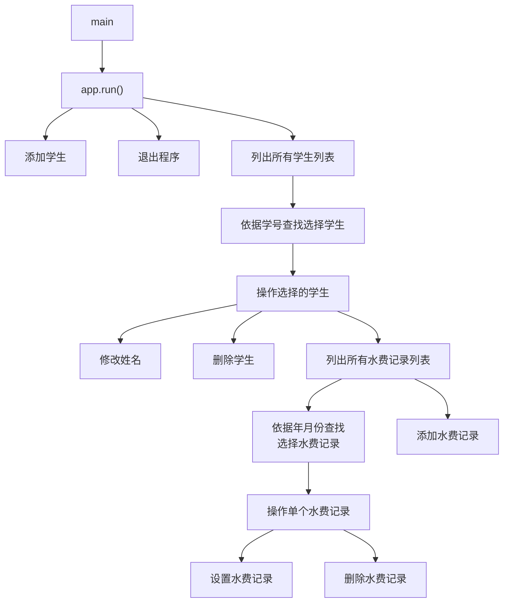
```mermaid
flowchart TD
    A[main] --> B["app.run()"]

    B -->C[添加学生]
    B -->D[退出程序]
    B -->E[列出所有学生列表]

    E --> F[依据学号查找选择学生]
    F --> G[操作选择的学生]

    G --> H[修改姓名]
    G --> I[删除学生]
    G --> J[列出所有水费记录列表]

    J --> K[依据年月份查找<br/>选择水费记录]
    J --> L[添加水费记录]

    K --> M[操作单个水费记录]

    M --> N[设置水费记录]
    M --> O[删除水费记录]
```

### 设计说明

*  **结构体和类储存学生数据。**
   `Student` 和 `WaterRecord` 定义数据结构。
   数据结构样式：

    ```cpp
    struct WaterRecord {
        int year;
        int month;
        double usage;
        double cost;
    };

    class Student { // 学生类，包含学号、姓名和水费记录等信息
    public:
        std::string id;
        std::string name;
        std::vector<WaterRecord> records;

        double getTotalUsage() const;
        double getTotalCost() const;
        int getWaterRecordIndex(int year, int month);
    };
    ```

	**此处呈现的代码不一定是最终代码，最终代码请翻阅文件查看。*

*  **使用动态数组供运行时修改。**
   使用 `std::vector<Student>` 类型动态储存数据，便于在运行时访问和修改。

*  **json 文件数据格式支持。**
   引入外部库 `json.hpp` 用于保存和解析数据文件，数据结构一目了然。

*  **清晰明了的架构设计。**
   `WaterManager` 类执行数组读取、修改的职责，不关心控制台界面设计；`App` 类实现控制台交互功能，不关心数据如何修改。

*  **灵活的指针与引用操作。**
   向其他函数传递对象的指针或引用，数据操作方便高效。

*  **分页查询支持。**
   `getAllStudents` 和 `getAllRecords` 支持分页显示，每页默认 12 条，页码自动边界检查。

*  **操作结果统一返回。**
   `WaterManager` 的所有修改操作返回 `result` 结构体，包含 `success`（是否成功）和 `info`（详细信息）两个字段。

*  **输入辅助函数统一处理。**
   `App` 类提供 `enterId`、`enterName`、`enterYear`、`enterMonth`、`enterUsage` 等函数，统一处理用户输入和合法性校验，支持 `/e` 中途退出。

*  **编码转换处理。** 提供
   `gbkToUtf8` 和 `utf8ToGbk` 函数，解决 Windows 控制台（GBK）与 JSON 文件（UTF-8）之间的中文编码转换问题。

*  **数据自动保存。**
   `WaterManager` 构造时调用 `loadFromFile()` 读取数据，析构时调用 `saveToFile()` 保存数据，每次修改操作后也会自动保存。

*  **文件加载容错。**
   加载 `students.json` 时若文件不存在或为空则正常启动；若 JSON 解析失败则自动备份原文件为 `students.json.bak`，并清空数据重新开始。

### 类型

#### App 类

##### 概要

实现控制台终端交互功能。

##### `App.run()` 方法

类型：`void`

说明：展示主菜单列表。输入标识选择操作功能。

流程图：

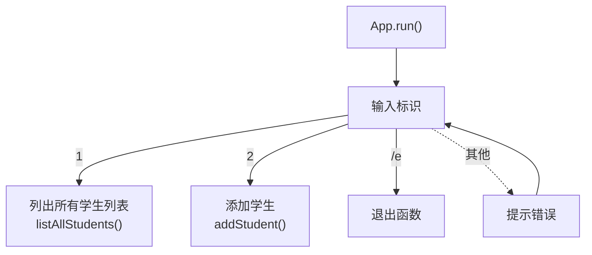
```mermaid
flowchart TD
	A["App.run()"] --> B[输入标识]
	B --> |1| C["列出所有学生列表<br/>listAllStudents()"]
	B --> |2| D["添加学生<br/>addStudent()"]
	B --> |/e| E[退出函数]
	B -.-> |其他| F[提示错误]
	F --> B
```

演示截图：

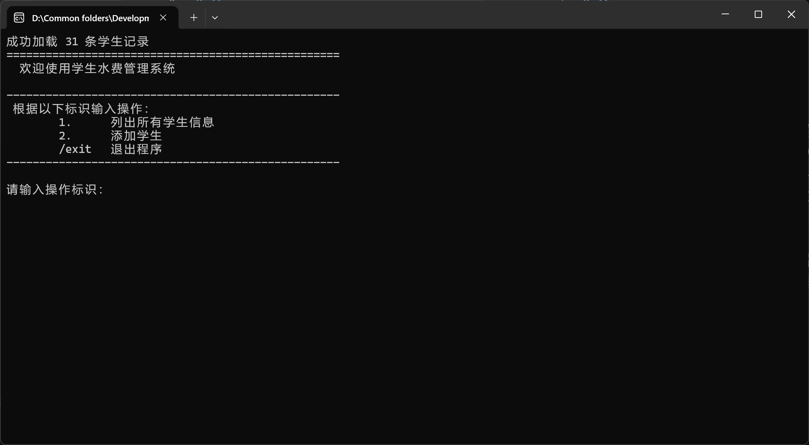

---

##### `App.addStudent()` 方法

类型：`void`

说明：展示添加学生菜单列表。输入学号和姓名添加学生，或输入 `/e` 标识取消添加操作。

流程图：

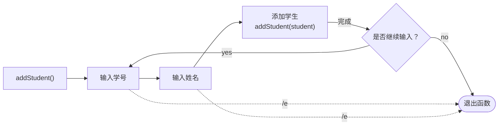
```mermaid
flowchart LR
    A["addStudent()"] --> B[输入学号]
    B --> C[输入姓名]
    C --> D["添加学生<br/>addStudent(student)"]
    D --> |完成| E{是否继续输入？}

    E --> |yes| B
    E --> |no| F([退出函数])

    B -.-> |"/e"| F
    C -.-> |"/e"| F
```

演示截图：

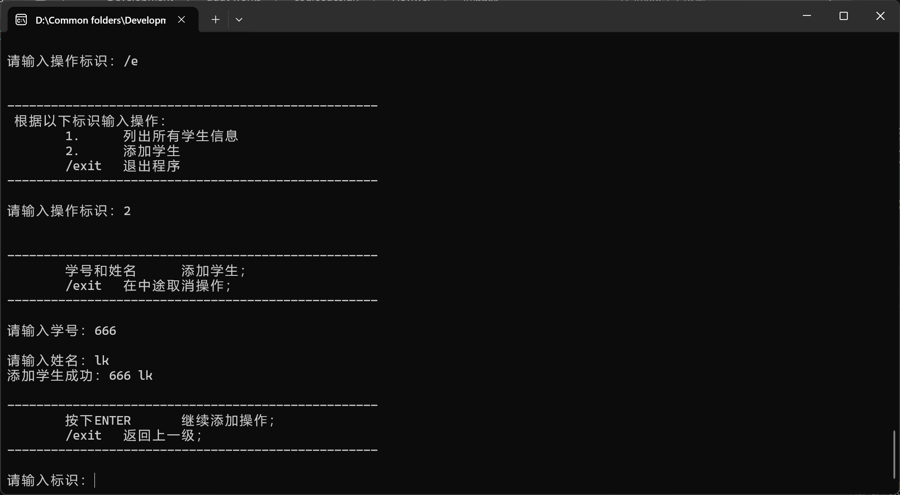

---

##### `App.listAllStudents()` 方法

类型：`void`

说明：展示所有学生列表。输入标识或页码翻阅页面浏览，或输入 `s[学号]` 查找选择学生。

流程图：

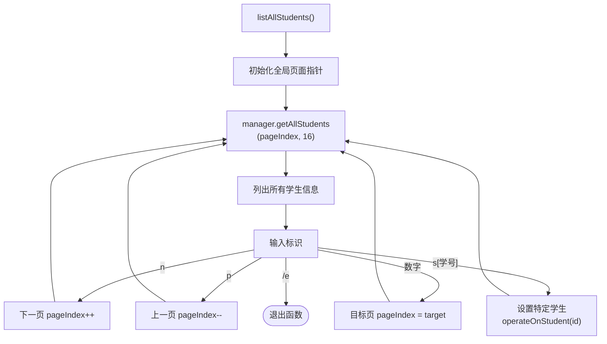
```mermaid
flowchart TD
    A["listAllStudents()"] --> B[初始化全局页面指针]
    B --> C["manager.getAllStudents<br/>(pageIndex, 16)"]
    C --> D[列出所有学生信息]

    D --> E[输入标识]
    E --> |n| F[下一页 pageIndex++]
    E --> |p| G[上一页 pageIndex--]
    E --> |数字| H[目标页 pageIndex = target]
    E --> |"s[学号]"| I["设置特定学生<br/>operateOnStudent(id)"]
    E --> |"/e"| J([退出函数])

    F --> C
    G --> C
    H --> C
    I --> C
```

演示截图：

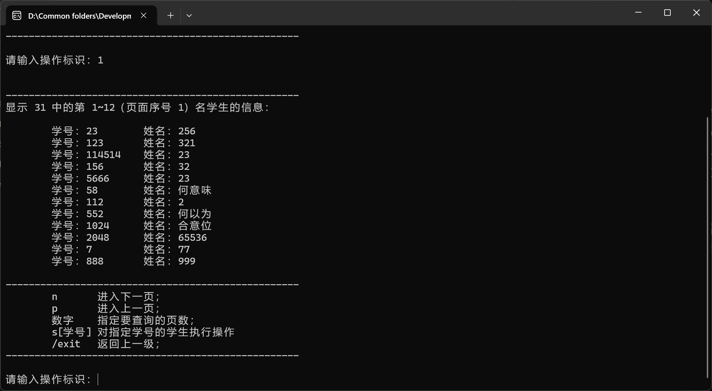

---

##### `App.listAllRecords(const std::string id)` 方法

类型：`void`

说明：展示所有水费记录列表。输入标识或页码翻阅页面浏览，或输入 `s[年-月]` 查找选择记录。

流程图：

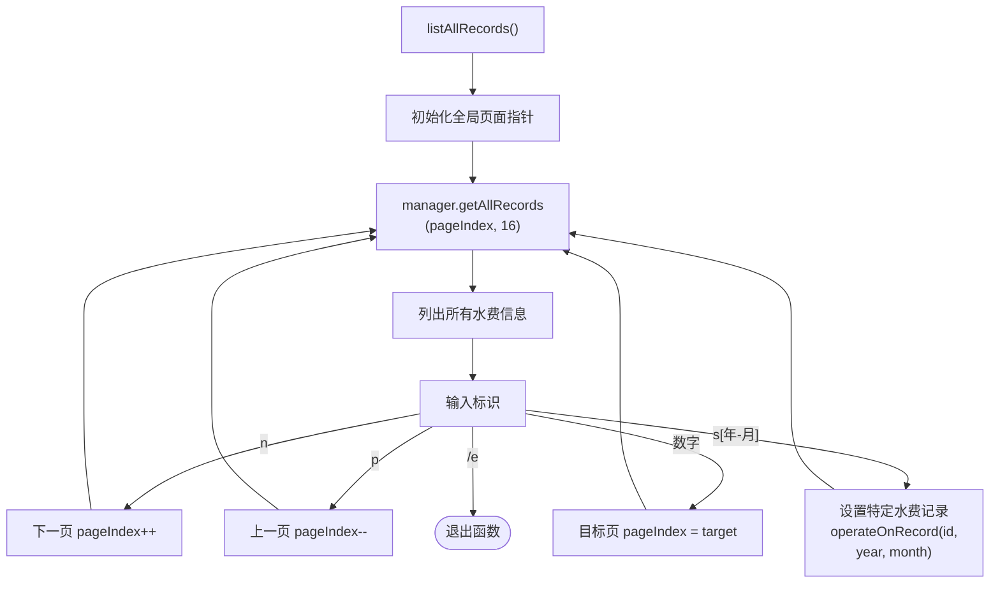
```mermaid
flowchart TD
    A["listAllRecords()"] --> B[初始化全局页面指针]
    B --> C["manager.getAllRecords<br/>(pageIndex, 16)"]
    C --> D[列出所有水费信息]

    D --> E[输入标识]
    E --> |n| F[下一页 pageIndex++]
    E --> |p| G[上一页 pageIndex--]
    E --> |数字| H[目标页 pageIndex = target]
    E --> |"s[年-月]"| I["设置特定水费记录<br/>operateOnRecord(id, <br/>year, month)"]
    E --> |"/e"| J([退出函数])

    F --> C
    G --> C
    H --> C
    I --> C
```

演示截图：

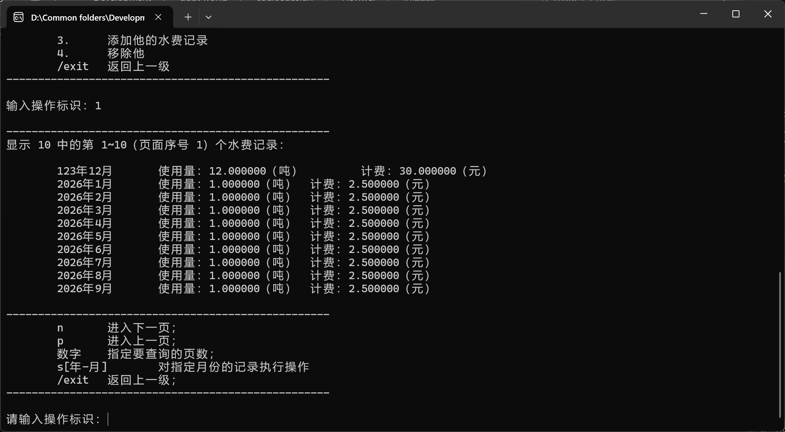

##### `App.operateOnStudent(const std::string id)` 方法

类型：`void`

说明：对单个学生执行操作。输入指定标识查看所有水费记录、设置姓名、添加水费记录、移除学生。

流程图：

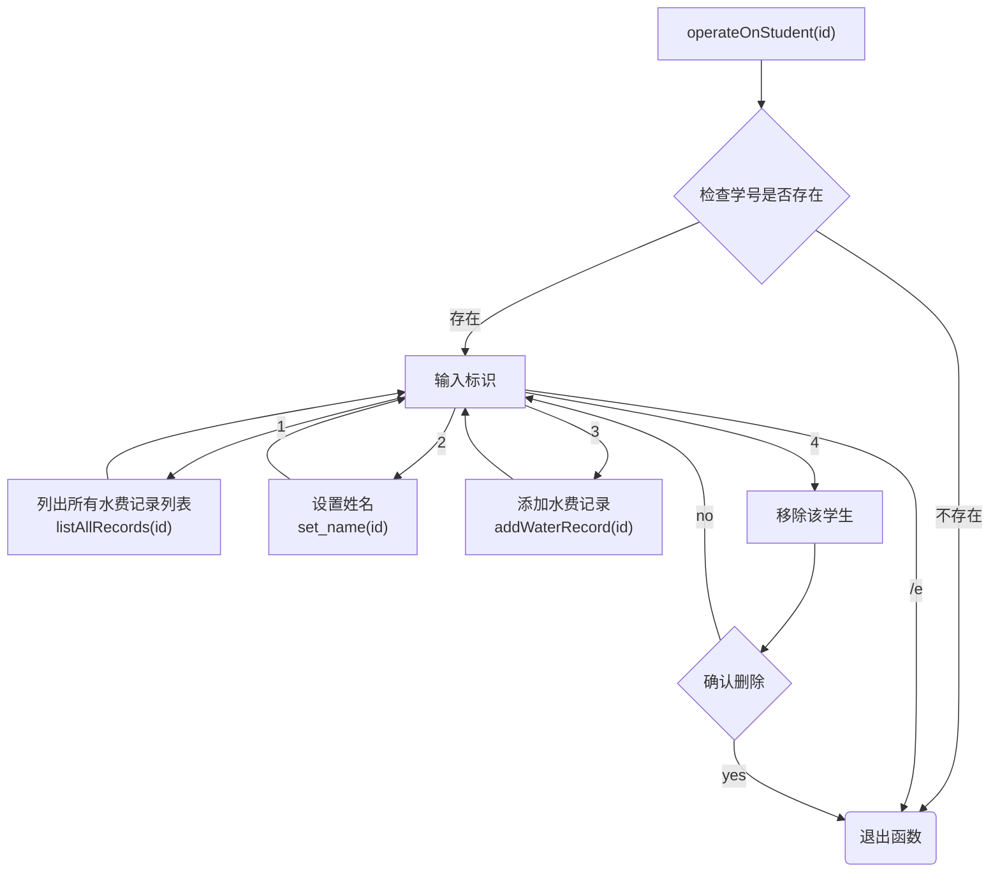
```mermaid
flowchart TD
    A["operateOnStudent(id)"] --> B{检查学号是否存在}

    B --> |不存在| C(退出函数)
    B --> |存在| D[输入标识]
    
    D --> |1| E["列出所有水费记录列表<br/>listAllRecords(id)"]
    D --> |2| F["设置姓名<br/>set_name(id)"]
    D --> |3| G["添加水费记录<br/>addWaterRecord(id)"]
    D --> |4| H[移除该学生]
    D --> |"/e"| C

    E --> D
    F --> D
    G --> D
    H --> I{确认删除}

    I --> |yes| C
    I --> |no| D
```

演示截图：

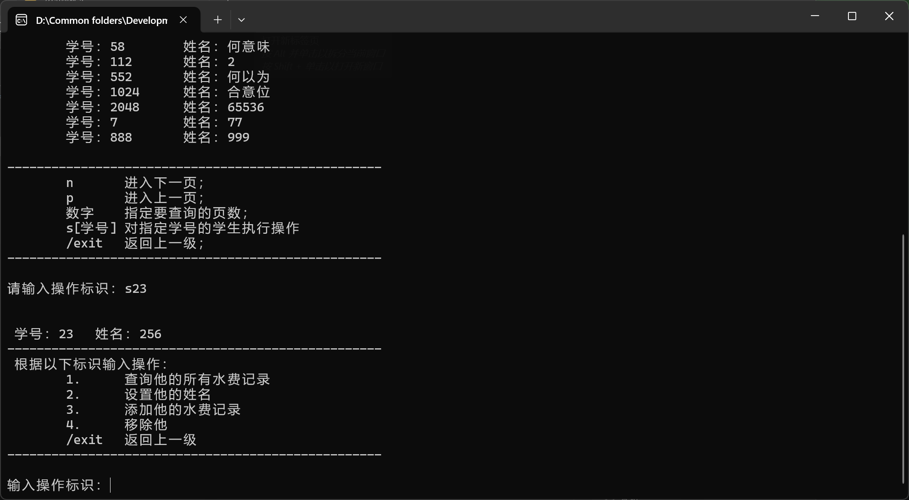

---

##### `App.addWaterRecord(const std::string id)`

类型：`void`

说明：添加水费记录。

流程图：

未制作

演示截图：

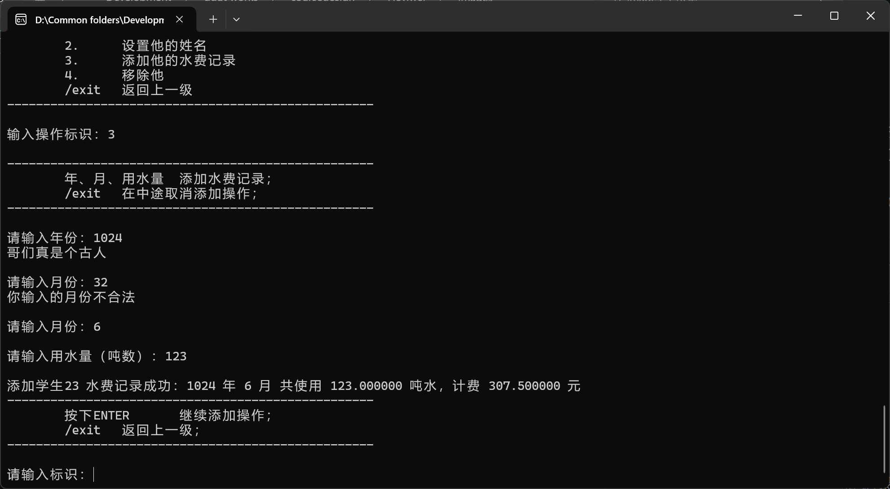

---

##### `App.operateOnRecord(const std::string id, int year, int month)`

类型：`void`

说明：对单个水费记录执行操作。输入指定标识设置这个水费记录、移除这个水费记录。

流程图：

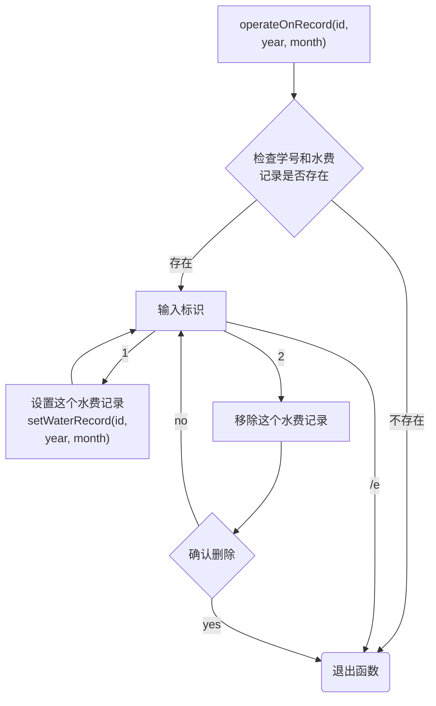
```mermaid
flowchart TD
    A["operateOnRecord(id,<br/> year, month)"] --> B{检查学号和水费<br/>记录是否存在}

    B --> |不存在| C(退出函数)
    B --> |存在| G[输入标识]
    
    G --> |1| D["设置这个水费记录<br/>setWaterRecord(id,<br/> year, month)"]
    G --> |2| E[移除这个水费记录]
    G --> |"/e"| C

    D --> G
    E --> F{确认删除}

    F --> |yes| C
    F --> |no| G
```

演示截图：

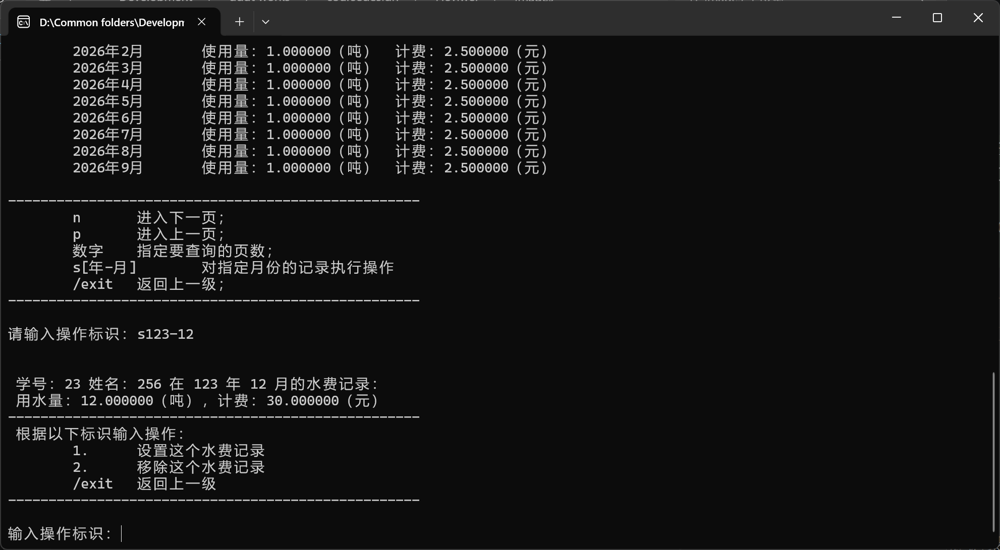

---

##### `App.setName(const std::string id)`

类型：`void`

说明：设置指定学生的名字。

流程图：

未制作

演示截图：

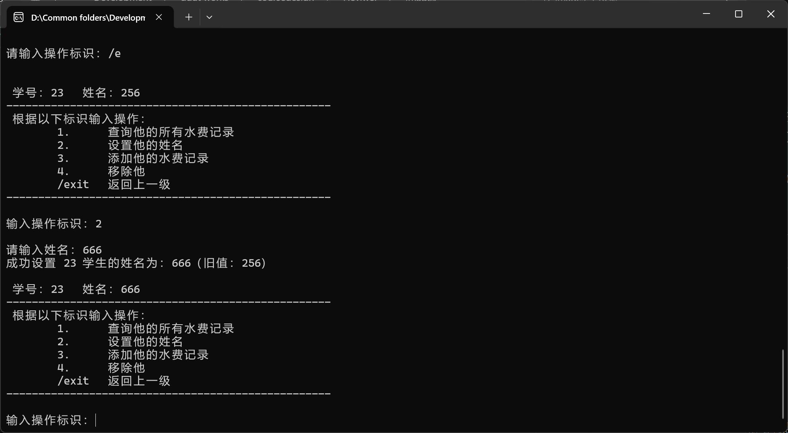

---

##### `App.setWaterRecord(const std::string id, int year, int month)`

类型：`void`

说明：设置指定学生在指定年月的水费记录。

流程图：

未制作

演示截图：

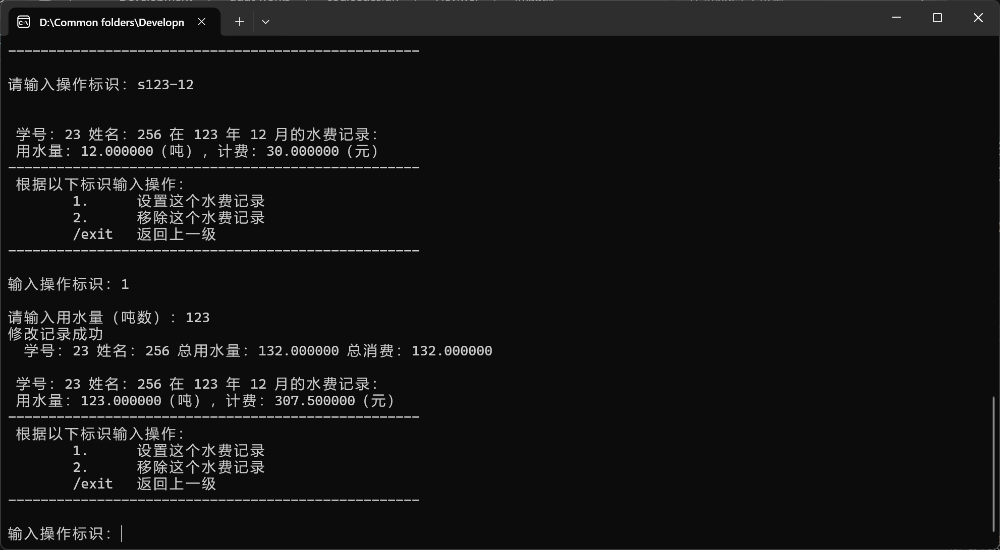

---

##### `App.enterStudent(Student& student)`

类型：`bool`

流程图：

未制作

---

##### `App.enterId(std::string& id)`

类型：`bool`

说明：输入学生学号。

流程图：

未制作

---

##### `App.enterName(std::string& name)`

类型：`bool`

说明：输入学生姓名。

流程图：

未制作

---

##### `App.enterMonth(int& month)`

类型：`bool`

说明：输入月份。

流程图：

未制作

---

##### `App.enterUsage(double& usage)`

类型：`bool`

说明：输入水费记录。

流程图：

未制作

---

##### `App.promptContinue()`

类型：`bool`

说明：提示是否继续。

流程图：

未制作

---

#### WaterManager 类

##### 概要

实现数据管理功能。

##### 编码转换辅助函数

由于 Windows 控制台使用 GBK 编码，而 JSON 文件使用 UTF-8 编码，需要两个辅助函数进行转换：

```cpp
std::string gbkToUtf8(const std::string& gbkStr);   // GBK → UTF-8（保存时使用）
std::string utf8ToGbk(const std::string& utf8Str);  // UTF-8 → GBK（加载时使用）
```

---

##### JSON 序列化/反序列化

使用 `nlohmann/json` 库，为 `WaterRecord` 和 `Student` 定义了 `to_json` 和 `from_json` 重载：

---

##### `WaterManager()` 构造函数

类型：无

说明：实例构造时自动调用 `loadFromFile()`，从 `students.json` 加载已有数据。

流程图：

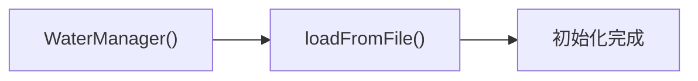
```mermaid
flowchart LR
    A["WaterManager()"] --> B["loadFromFile()"]
    B --> C["初始化完成"]
```

---

##### `~WaterManager()` 析构函数

类型：无

说明：实例销毁时自动调用 `saveToFile()`，将数据保存到 `students.json`。

流程图：

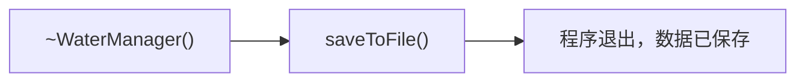
```mermaid
flowchart LR
    A["~WaterManager()"] --> B["saveToFile()"]
    B --> C["程序退出，数据已保存"]
```

---

##### `WaterManager.loadFromFile()` 方法

类型：`void`

说明：从 `data.json` 文件加载数据。如果文件不存在、为空或格式错误，会进行相应处理（空文件或解析失败时会备份原文件）。

流程图：

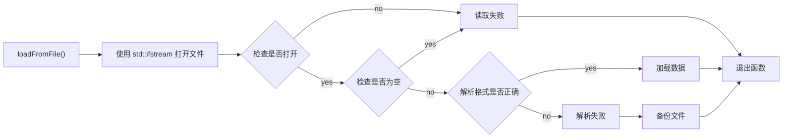
```mermaid
flowchart LR
    A["loadFromFile()"] --> B[使用 std::ifstream 打开文件]
    B --> C{检查是否打开}
    C --> |no| D[读取失败]

    D --> E[退出函数]

    C --> |yes| F{检查是否为空}

    F --> |yes| D

    F --> |no| G{解析格式是否正确}
    G --> |yes| H[加载数据]
    H --> E

    G --> |no| I[解析失败]

    I --> J[备份文件]
    J --> E

```

---

##### `WaterManager.saveToFile()` 方法

类型：`void`

说明：将当前数据保存到 `data.json` 文件。在程序退出前或每次数据修改后自动调用。

流程图：

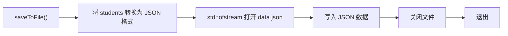
```mermaid
flowchart LR
    A["saveToFile()"] --> B["将 students 转换为 JSON 格式"]
    B --> C["std::ofstream 打开 data.json"]
    C --> D["写入 JSON 数据"]
    D --> E["关闭文件"]
    E --> F["退出"]
```

---

##### `WaterManager.findStudentIndex(const std::string& id)` 方法

类型：`int`

说明：根据学号遍历 `students` 数组，若找到匹配的学生返回其索引，否则返回 -1。

流程图：

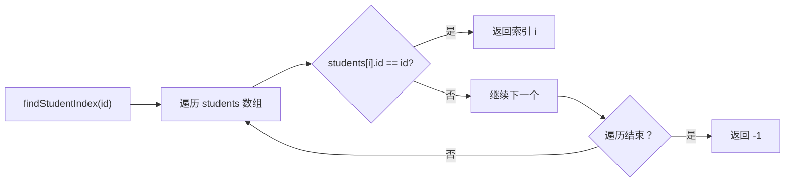
```mermaid
flowchart LR
    A["findStudentIndex(id)"] --> B["遍历 students 数组"]
    B --> C{"students[i].id == id?"}
    C --> |是| D["返回索引 i"]
    C --> |否| E["继续下一个"]
    E --> F{遍历结束？}
    F --> |否| B
    F --> |是| G["返回 -1"]
```

---

##### `WaterManager.addStudent(Student student)` 方法

类型：`Result`

说明：添加新学生。会检查学号是否已存在，以及学号是否包含程序保留标识符。

流程图：

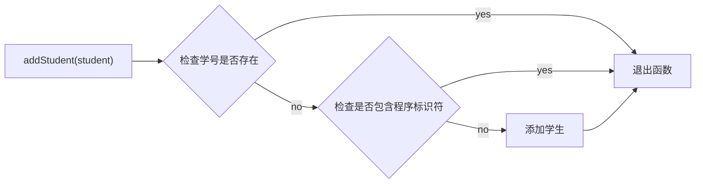
```mermaid
flowchart LR
    A["addStudent(student)"] --> B{检查学号是否存在}

    B --> |yes| C[退出函数]
    B --> |no| D{检查是否包含程序标识符}

    D --> |yes| C
    D --> |no| E[添加学生]

    E --> C
```

---

##### `WaterManager.setStudent(const std::string& id, const std::string& name)` 方法

类型：`result`

说明：修改指定学生的姓名。

流程图：

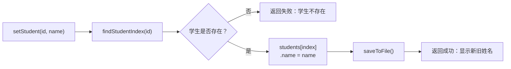
```mermaid
flowchart LR
    A["setStudent(id, name)"] --> B["findStudentIndex(id)"]
    B --> C{学生是否存在？}
    C --> |否| D["返回失败：学生不存在"]
    C --> |是| E["students[index]<br/>.name = name"]
    E --> F["saveToFile()"]
    F --> G["返回成功：显示新旧姓名"]
```

---

##### `WaterManager.removeStudent(const std::string& id)` 方法

类型：`result`

说明：删除指定学生及其所有水费记录。

流程图：

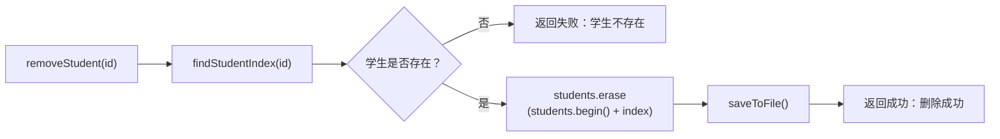
```mermaid
flowchart LR
    A["removeStudent(id)"] --> B["findStudentIndex(id)"]
    B --> C{学生是否存在？}
    C --> |否| D["返回失败：学生不存在"]
    C --> |是| E["students.erase<br/>(students.begin() + index)"]
    E --> F["saveToFile()"]
    F --> G["返回成功：删除成功"]
```

---

##### `WaterManager.addWaterRecord(const std::string& id, const WaterRecord& record)` 方法

类型：`result`

说明：为指定学生添加水费记录。会检查该年月份是否已有记录（不允许重复）。

流程图：

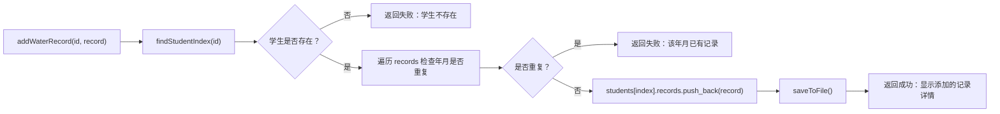
```mermaid
flowchart LR
    A["addWaterRecord(id, record)"] --> B["findStudentIndex(id)"]
    B --> C{学生是否存在？}
    C --> |否| D["返回失败：学生不存在"]
    C --> |是| E["遍历 records 检查年月是否重复"]
    E --> F{是否重复？}
    F --> |是| G["返回失败：该年月已有记录"]
    F --> |否| H["students[index].records.push_back(record)"]
    H --> I["saveToFile()"]
    I --> J["返回成功：显示添加的记录详情"]
```

---

##### `WaterManager.setWaterRecord(const std::string& id, int year, int month, double usage)` 方法

类型：`result`

说明：修改指定学生在指定月份的水费记录（用水量）。费用自动按单价重新计算。

流程图：

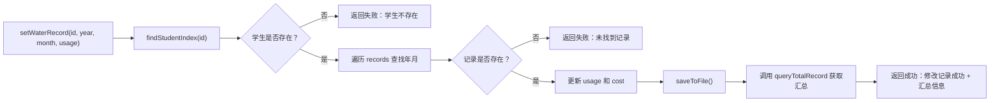
```mermaid
flowchart LR
    A["setWaterRecord(id, year, month, usage)"] --> B["findStudentIndex(id)"]
    B --> C{学生是否存在？}
    C --> |否| D["返回失败：学生不存在"]
    C --> |是| E["遍历 records 查找年月"]
    E --> F{记录是否存在？}
    F --> |否| G["返回失败：未找到记录"]
    F --> |是| H["更新 usage 和 cost"]
    H --> I["saveToFile()"]
    I --> J["调用 queryTotalRecord 获取汇总"]
    J --> K["返回成功：修改记录成功 + 汇总信息"]
```

---

##### `WaterManager.removeWaterRecord(const std::string& id, int year, int month)` 方法

类型：`result`

说明：删除指定学生在指定月份的水费记录。

流程图：

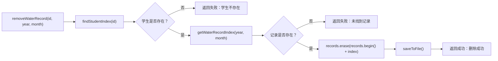
```mermaid
flowchart LR
    A["removeWaterRecord(id, year, month)"] --> B["findStudentIndex(id)"]
    B --> C{学生是否存在？}
    C --> |否| D["返回失败：学生不存在"]
    C --> |是| E["getWaterRecordIndex(year, month)"]
    E --> F{记录是否存在？}
    F --> |否| G["返回失败：未找到记录"]
    F --> |是| H["records.erase(records.begin() + index)"]
    H --> I["saveToFile()"]
    I --> J["返回成功：删除成功"]
```

---

##### `WaterManager.getStudent(const std::string& id)` 方法

类型：`Student*`

说明：根据学号获取指向学生的指针。若不存在返回 `nullptr`。

流程图：

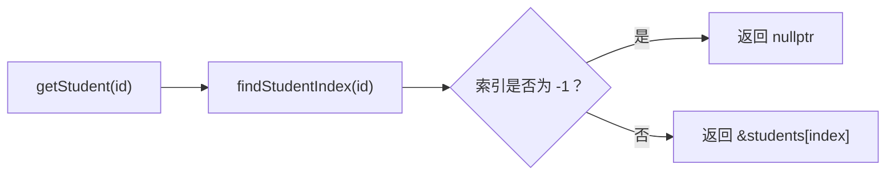
```mermaid
flowchart LR
    A["getStudent(id)"] --> B["findStudentIndex(id)"]
    B --> C{索引是否为 -1？}
    C --> |是| D["返回 nullptr"]
    C --> |否| E["返回 &students[index]"]
```

---

## 总结

本次课程设计我们完成了学生水费管理系统的开发，实现了学生信息管理、水费记录管理、分页显示、数据持久化等功能。系统在 Windows 控制台下运行，支持统一退出指令（`/e`）和完整的输入合法性校验。

**技术收获**
巩固了 C++ 类与对象、`std::vector`、文件读写、异常处理等知识；掌握了 JSON 数据的序列化与反序列化；通过解决 GBK 与 UTF-8 编码转换问题（“锟斤拷”乱码），加深了对字符编码的理解。

**设计体会**
将系统划分为 `App`（界面交互）与 `WaterManager`（数据管理）两个核心类，实现了职责分离。分页显示、删除前二次确认、即时保存、文件损坏自动备份等设计，提升了程序的健壮性和用户体验。

**问题解决**
遇到了三个主要问题：控制台中文乱码、直接关闭窗口导致数据丢失、JSON 文件损坏引发程序崩溃。分别采用编码转换、即时保存、异常捕获加自动备份的方式解决。

**不足与改进**
本系统为命令行界面，后续可开发图形界面；数据存储可迁移至 SQLite 以支持更大数据量；可增加多用户权限管理功能。

通过本次课程设计，我们不仅综合运用了所学知识，也经历了一次从需求到实现的完整开发流程。

## 另请参阅

[本项目的 Github 仓库 | forer-lika777/Heyiwei](https://github.com/forer-lika777/Heyiwei "https://github.com/forer-lika777/Heyiwei")  
[c++中utf8字符串和gbk字符串的转换-腾讯云开发者社区-腾讯云](https://cloud.tencent.com/developer/article/2476960 "https://cloud.tencent.com/developer/article/2476960")  
[C++ 文档 | Microsoft Learn](https://learn.microsoft.com/zh-cn/cpp/cpp/?view=msvc-170 "https://learn.microsoft.com/zh-cn/cpp/cpp/?view=msvc-170")  
[JSON for Modern C++ (nlohmann/json.hpp)](https://json.nlohmann.me/ "https://json.nlohmann.me/")  
